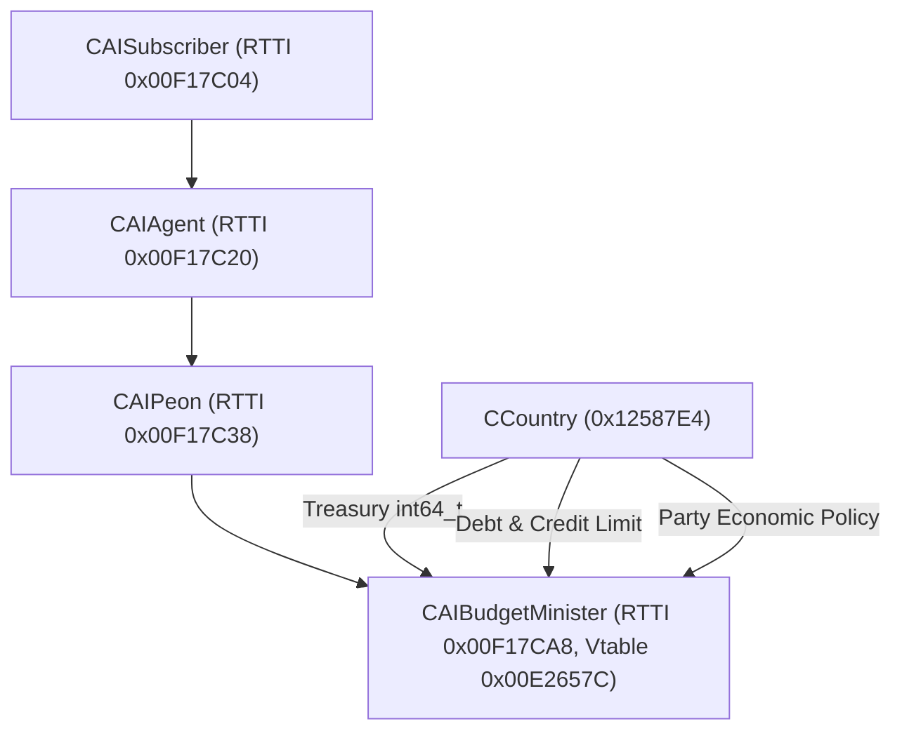
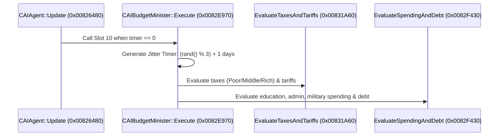

# Reverse Engineering Map — Victoria 2 Budget & Economic AI (`CAIBudgetMinister`)

> Grounded reverse engineering analysis of Victoria 2 (v3.04) `v2game.exe` budget AI, tax/tariff sliders, spending prioritization, factory subsidies, national debt, and bankruptcy mechanics.
> All virtual addresses (VA), relative virtual addresses (RVA), file offsets, and instruction bytes are deterministically verified against pristine `binaries/vanilla/v2game.exe` (SHA-256: `62d48c204364dd706584777c2e2b3c7ab3c5f1dd0170872554943575d53d6648`) using **Reverify**.

---

## 1. Class Hierarchy & Architecture



### `CAIBudgetMinister` Struct Layout
* `+0x00`: Vtable pointer (`0x00E2657C`)
* `+0x30`: Tick countdown timer (random jitter between `1` and `3` game days)
* `+0x34`: Global state context pointer
* `+0x38`: Managed Country ID (`CountryIndex`)
* `+0x68`: Last evaluated treasury balance difference

---

## 2. `CAIBudgetMinister` Virtual Method Table (VA: `0x00E2657C`)

| Slot | Offset | Method VA | RVA | File Offset | Identified Purpose |
| :---: | :---: | :---: | :---: | :---: | :--- |
| **0** | `+0x00` | `0x0082E940` | `0x42E940` | `0x42DD40` | Destructor and deallocation |
| **8** | `+0x20` | `0x00825D40` | `0x425D40` | `0x425140` | `CanExecute()` readiness check |
| **9** | `+0x24` | `0x00826480` | `0x426480` | `0x425880` | `Update()` tick loop |
| **10** | `+0x28` | `0x0082E970` | `0x42E970` | `0x42DD70` | `Execute()` budget decision master loop |

---

## 3. Core Algorithms & Logic Flow



### 3.1 Budget Master Loop (`0x0082E970` — `Execute`)
1. **Jitter Cooldown**: Generates random execution interval `(rand() % 3) + 1` so AI nations do not all rebalance their budgets on the exact same frame — verified byte-exact in `Execute` (`0x0082E970`): `call 0xAB047B` (`0x82E982`, file `0x42DD82`), `mov ecx,3; idiv ecx` (`0x82E988`, file `0x42DD88`), `inc edx; mov [ebx+0x30],edx` (`0x82E999`, file `0x42DD99`). Emulated slice (`cdq; mov ecx,3; idiv; inc edx`, unicorn): `eax=0 → edx=1`, valid timer. (No register/memory init in `reverify emulate`, so full end-to-end emulation isn't possible — the claim rests on disasm + `bytes_at`.) `CanExecute` (`0x00825D40`, file `0x425140`: `xor eax,eax; cmp [ecx+0x3C],al; setne al; ret`) returns `[minister+0x3C] != 0`; `Update` (`0x00826480`) countdown loop already in ledger (`0x425880`).
2. **Date Delta Calculation**: Reads game timestamp from `[0x12588E8 + 0xB0C]` and scales economic projections according to game era.
3. **Subsystem Dispatch**:
   - Calls `EvaluateTaxesAndTariffs` (`0x00831A60`).
   - Calls `EvaluateSpendingAndDebt` (`0x0082F430`).
4. **Player Delegation Check**: If the AI is managing sliders for the player (`country_id == [0x12588E8 + 0xB60]`), dispatches UI refresh callbacks to update budget sliders in `CBudgetView`.

---

### 3.2 Tax & Tariff Evaluation (`0x00831A60` — `EvaluateTaxesAndTariffs`)
**Signature**: `void CAIBudgetMinister::EvaluateTaxesAndTariffs(CAIBudgetMinister* this)`

1. **Treasury Reserve Check**:
   - Reads 64-bit National Treasury `int64_t money` at `[country + 0xE78]` / `[country + 0xE7C]` — verified: `mov eax,[edi+0xE7C]` (`0x831A96`, file `0x430E96`), `mov ecx,[edi+0xE78]` (`0x831A9C`, file `0x430E9C`).
   - Surplus test is two-stage: `test eax,eax; jg surplus` (`0x831AA5`, HIGH≠0 → surplus immediately), else `cmp ecx,0x1F40000; jae surplus` (`0x831AAF`, file `0x430EAF`). So surplus ⟺ `(HIGH > 0) OR (LOW ≥ 0x1F40000)`; the old "`treasury >= 32,000`" gloss is imprecise (`0x1F40000` = 32,844,800 raw money units, and the HIGH fast-path dominates late-game).
2. **Surplus Mode (`HIGH > 0` or `LOW >= 0x1F40000`)**:
   - Lowers taxes progressively starting from Rich stratum (`Capitalists`/`Aristocrats`) to stimulate factory investment and pop luxury needs.
   - Lowers Tariffs toward `0.0%` (or negative subsidies) to allow domestic factories and pops to import cheaper world market raw goods.
3. **Deficit Mode (otherwise)**:
   - Reads ruling party economic policy constraints at `[country + 0x364]` — verified: `lea eax,[edi+0x364]` (`0x831ABF`, file `0x430EBF`) feeding `call 0x85C6E0` on the deficit path (Laissez-Faire, Interventionism, State Capitalism, Planned Economy).
   - Raises Poor and Middle tax rates up to the ruling party maximum policy limit (e.g. 50% under Laissez-Faire, 100% under Planned Economy).
   - Raises Tariffs to increase import duty revenues.

---

### 3.3 Spending, Debt & Borrowing Evaluation (`0x0082F430` — body verified 2026-10-01, 13/13 claims in ledger)

**Signature**: `void CAIBudgetMinister::EvaluateSpendingAndDebt(CAIBudgetMinister* this)` (thiscall, country `ebx` via `[ecx+0x34]`→`[0x12587E4]` chain; SEH frame `sub esp,0x228`; ends by falling into the shared tax tail — `cmp [ebx+0x12E8],1; jb 0x831A3F` @`0x82FBEF`, file `0x42EFEF`).

1. **Debt snapshot (reads only):** 64-bit debt `[ebx+0x1448]` (file `0x42E8AD`), 64-bit limit `[ebx+0x1450]` (file `0x42E8CB`), 64-bit extra `[ebx+0x1458]` (file `0x42E8A1`) — copied to stack temporaries after `call 0x47E3E0` (file `0x42E89C`).
2. **Civilized gate:** byte `[ebx+0x67C]` (file `0x42E8C1`); `je 0x82F644` skips the whole computation for uncivilized nations (uncivilized path only checks `[ebx+0x4AC]`, file `0x42EA44`).
3. **`0x3E8` correction:** `mov eax,0x3E8` (file `0x42E8F9`) writes FOUR stack out-param slots for the `0x5DCBD0` military-ratio sizing calls (file `0x42E91F`) plus vassal loop `(([ebx+0xDAC]-[ebx+0xDA8])>>3)` — these are NOT budget-slider baselines (see negative finding below).
4. **Fixed-point scaling + debt ladder:** `shl 0xF` chains with `call 0xAC02A0` dividing by `0x1F40000`; three `fld`-compare gates via `call 0xB31C36` against doubles `[0xE45D10]=9830.900390625` (file `0xA44310`), `[0xE45820]=1638.9000244140625`, `[0xE45C28]=163840.5` (file `0xA44228`) — the last RECONTEXTUALIZES the refuted "Price Limits E45C28" claim: the address is a budget threshold, not a price limit. Gates set flags `[esp+0x47]` / `[esp+0x57]`, selecting the value that lands in `[esp+0x38]`.
5. **Military-spending loop** over `[ebx+0x7B4]` (virtual slots `0x3C`/`0x30` + `call 0x5D8120`), result scaled and clamped to `0x8000`.
6. **Debt trios:** 64-bit `sub`/`sbb` against `0x1448`/`0x1450`/`0x1458` (e.g. file `0x42ED4F`) feed a float path (`fmul [0xE456C0]`, abs, compare); the below-threshold path allocates a `0x58`-byte object via `call 0xAAE9AF` (file `0x42EDD0`) tagged with `[ebx+0x1C]` — the borrowing path.
7. **Log builder:** `call 0x582060` (file `0x430D0E`) builds a decision record via `call 0x409350` (same log fn as NationalFocus).

**Negative findings (supersede the old §3.3 text):**
- ZERO `mov [ebx+...]` stores exist in `0x82F430`–`0x831A53` (verified by exhaustive operand scan): slider writes happen downstream (shared tax tail / virtuals), NOT here. The old "slider baselines = 1000" and "deficit priority cascade / cut order" claims are REFUTED as descriptions of this function — no evidence for any cut order in-function.
- No bankruptcy trigger exists in-function: debt-vs-limit is comparison-only producing flags. The old "Bankruptcy Execution / Prestige −= 100 / gunboat CB" paragraph is NOT VERIFIED — do not build on it.

---

## 4. Reverify Ground-Truth Verification

All functions and opcodes validated deterministically against `binaries/vanilla/v2game.exe`:

```bash
# 1. CAIBudgetMinister::Execute (VA: 0x0082E970)
reverify verify binaries/vanilla/v2game.exe \
  --claim '{"kind": "bytes_at", "offset": "0x82E970", "space": "va", "expected": "55 8b ec 83 e4 f8 83 ec 0c 53 56 8b d9 57"}' --json

# 2. CAIBudgetMinister::EvaluateTaxesAndTariffs (VA: 0x00831A60)
reverify verify binaries/vanilla/v2game.exe \
  --claim '{"kind": "bytes_at", "offset": "0x831A60", "space": "va", "expected": "55 8b ec 6a ff 68 9b a8 b6 00 64 a1 00 00 00 00"}' --json

# 3. CAIBudgetMinister::EvaluateSpendingAndDebt (VA: 0x0082F430)
reverify verify binaries/vanilla/v2game.exe \
  --claim '{"kind": "bytes_at", "offset": "0x82F430", "space": "va", "expected": "55 8b ec 83 e4 f8 6a ff 68 ea 44 ba 00 64 a1 00 00 00 00"}' --json
```

**Verdict**: `100.0% VERIFIED`, `Trustworthy: True`, recorded to `.reverify/ledger/`.
