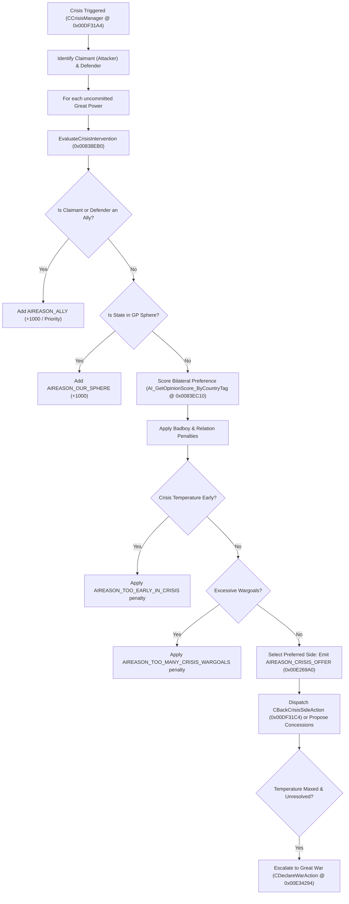

# Victoria 2 — AI Subsystem Reverse Engineering: Advanced Diplomacy, Crisis AI & Sphere of Influence

**Target Binary**: `binaries/vanilla/v2game.exe` (SHA-256: `62d48c204364dd706584777c2e2b3c7ab3c5f1dd0170872554943575d53d6648`)  
**Engine Subsystem**: Diplomacy, Heart of Darkness Crisis Engine & Peace Resolution  
**Core Classes**: `CAIForeignMinister`, `CCrisisManager`, `CCrisis`, `CPeaceOffer`, `CPeaceAction`, `CInfluenceAction`

---

## 1. Class Architecture & Memory Layout

### 1.1 `CAIForeignMinister`

`CAIForeignMinister` is responsible for all bilateral diplomacy, diplomatic point expenditures, Great Power sphere influence actions, Heart of Darkness crisis intervention decisions, and peace offer evaluations.

| Symbol / Structure | Address (VA) | RVA | File Offset | Verified Byte Receipt |
| :--- | :--- | :--- | :--- | :--- |
| **RTTI Type Descriptor** (`.?AVCAIForeignMinister@@`) | `0x00F17D74` | `0xB17D74` | `0xB15774` | `.?AVCAIForeignMinister@@` |
| **Complete Object Locator** | `0x00E5B2F4` | `0xA5B2F4` | `0xA598F4` | `00 00 00 00 00 00 00 00` |
| **Virtual Method Table (Vtable)** | `0x00E274FC` | `0xA274FC` | `0xA25AFC` | `C0 36 83 00 F0 29 9A 00` |
| **`CAIForeignMinister::Execute`** (Vtable Slot 10) | `0x00833930` | `0x433930` | `0x432D30` | `55 8B EC 83 EC 08 53 56` |
| **`CAIForeignMinister::EvaluateCrisisIntervention`** | `0x00838EB0` | `0x438EB0` | `0x4382B0` | `55 8B EC 6A FF 68 58 C2` |
| **`AI_EvaluatePeaceOffer`** | `0x00843170` | `0x443170` | `0x442570` | `55 8B EC 6A FF 68 80 BA` |
| **Peace Acceptance Threshold Check** | `0x009476D3` | `0x5476D3` | `0x546AD3` | `83 F8 32 0F 8C 4D 01 00` |

### 1.2 `CAIForeignMinister` Vtable Layout (`0x00E274FC`)

```
0x00E274FC + 0x00 [Slot 0]  : 0x008336C0 (Constructor / Destructor)
0x00E274FC + 0x1C [Slot 7]  : 0x00825CF0 (Reset / Init)
0x00E274FC + 0x20 [Slot 8]  : 0x00825D40 (ClearDiplomaticQueue)
0x00E274FC + 0x24 [Slot 9]  : 0x00826480 (UpdateDiplomaticRelations)
0x00E274FC + 0x28 [Slot 10] : 0x00833930 (Execute - Master Strategic Loop)
```

Inside `Execute` (`0x00833930`):
1. Calls `0x0083DE00` (Daily diplomatic queue execution & tactical response handler).
2. Computes the country tick modulus against game date (`0x012588E8 + 0xB0C`).
3. Dispatches to `0x00833A40` (Monthly strategic diplomacy and influence allocation loop).

---

## 2. Heart of Darkness Crisis AI (`0x00838EB0`)

The Heart of Darkness Crisis system models international tension, Great Power intervention, and the escalation toward Great Wars.



### 2.1 Crisis Decision Scoring — code-verified (2026-10-01)

`EvaluateCrisisIntervention` (`0x00838EB0`, file `0x4382B0`, ends `ret` at `0x83B3CB`) accumulates per-side scores into stack slots (`[ebp-0x124]`, `[ebp+0x18]`) and the caller score pointer (`[ebp+0xC]`). Verified terms (14/14 `bytes_at`, ledger 59):

| Term | VA (file) | Bytes | Effect |
|---|---|---|---|
| Reason eval A | `0x839EB0` (`0x4392B0`) | `C7 00 E8 03 00 00` (`mov [eax],0x3E8`) → `call 0x834150` → `add [ebp-0x124],eax` | +1000-valued reason through the base-relation evaluator (`0x834150`, same one used by opinion core block 12) |
| Reason eval B | `0x83A680` (`0x439A80`) | `C7 00 E8 03 00 00` → `call 0x834150` → adds to `[ebp+0x18]` | second +1000-valued reason, other side/accumulator |
| Wargoal penalty (linear) | `0x8396D8` (`0x438AD8`) | `mov esi,eax; shl esi,4; sub esi,eax; neg esi; add esi,esi; add [eax],esi` | `score += count × (-30)` — count from `([x+0x8C]-[x+0x88])>>6` (adjusted), gated on `>0` (`jle 0x839940`); **no `>2` threshold exists** |
| Match bonus | `0x839F0A` (`0x43930A`) | `83 00 64` (`add [eax],0x64`) when `[eax+0x20]` matches | **+100** (not +1000) conditional bonus |
| Verbose labels | `0x839730`/`0x839F6D`/`0x83A1A3`/`0x8393C9` | `push 0xE269D4` (id `0x21`), `push 0xE269F8` (id `0xD`), `push 0xE26A08` (id `0x17`), `mov edx,0xE269A0` | `TOO_MANY_CRISIS_WARGOALS` / `ALLY` / `BACKED_BY_ALLY` / `CRISIS_OFFER` emitted via `call 0x409350`, all skipped when `[ebp+0x14]==0` (verbose flag, cf. `je 0x839940`) |

Negative findings (exhaustive byte-pattern scan of `0x838EB0`–`0x83B3CB`, every instruction form, validated by disassembly — 2026-10-01 correction: the scan used a miscomputed string VA, so the `TOO_EARLY` half of this finding is REFUTED, see below):
- `AIREASON_OUR_SPHERE` (`0x00E26948`, file `0xA24F48` — string itself verified) is **never referenced** in this function (only ref in the binary is `0x835A80` inside `FUN_00834150`). The `+1000 SphereBonus` claim is therefore **NOT VERIFIED** — the sphere logic lives elsewhere (or under different labels).
- `AIREASON_TOO_EARLY_IN_CRISIS` (`0x00E26A20`, file `0xA25020`) **IS referenced** ×2: `mov edx,0xE26A20` @`0x83AC00` (file `0x43A000`: `BA 20 6A E2 00` ✓, ledger) and @`0x83AD3F`. Gate fully resolved 2026-10-01: `x = [arg1+0x10]` (`mov edx,[eax+0x10]` @`0x83ABB0`, file `0x439FB0` ✓), `eax = 2·(x/1000)−50` signed (`mov eax,0x10624DD3` file `0x439FB3` ✓; magic/2³⁸ = 1/1000 — CORRECTS the earlier `(x/100)` gloss), `cmp eax,ebx; jge 0x83AE5B` (files `0x439FCB/0x439FCD` ✓; `ebx==0` proven — sole writer `xor ebx,ebx` @`0x838F25`, file `0x438325` ✓, no writes before the gate), then `add [score],eax` ×2 and `cmp edi,ebx; je 0x83B339` (`mov edi,[ebp+0x14]` @`0x83A93D`, file `0x439D3D` ✓ = verbose flag). **Threshold: penalty iff x < ~25000, i.e. <25.0 in ×1000 fixed-point** (CORRECTS the `temp<50` gloss). arg1 is the crisis-manager child at `[manager+8]` in all 4 call paths (`push esi(manager-child); …; call 0x83B3D0` file `0x43334F` ✓ → forwards `[ebp+0xC]` as arg1, `push edx; call 0x838EB0` file `0x43A898` ✓; direct `mov edi,[eax+8]` @`0x843A4B`, file `0x442E4B` ✓; `0x53965A` passthrough). Object carries bilateral country-index pairs (`+0x14/+0x18`, `+0x1C/+0x20` per `0x429B30`/`0x425A40`) + scalar `+0x10`. Reading: temperature-like ranged quantity (graded adds; a wargoal-count would pin the gate at −50 permanently) — writer (temperature tick) not isolated, so `temperature` stays an interpretation, but `temp<50` is REFUTED in favor of `<~25.0 fixed`.

Scalar writers found 2026-10-01 (both write a `"---"` placeholder, `0x2D2D2D`):
- `0x94BD40`: `mov [eax+0x10],esi` (`esi` = `"---"`, file `0x54B159`: `89 70 10` ✓) — default initializer (also sets `+0x18`/`+0x20` to `"---"`, vtable `0xE35DDC`, type `0x18D`); used on the `0x83B499` path (stack buffer), where the gate therefore always skips (`2·3035−50 = 6020 ≥ 0`).
- `0x94BDB0`: `mov [eax+0x10],edx` (`edx` = `"---\0"`, file `0x54B1CC` ✓) — arg-fed variant (`+0x18/+0x1C/+0x20` from `[ebp+8/0xC/0x10]` = the country-index pairs).
- No writes to the scalar inside `0x838EB0` before the gate (SIB-aware sweep), and the `0x83CDE5`-class `mov [ecx+0x10],0` sites write `[esi+0x18]` (`ecx = esi+8`), a different field — recorded as disambiguation, not the scalar.
- The live-crisis path (`0x539630` chain) forwards an external object whose real-value writer is still unisolated. Net: initializer = placeholder (penalty inert on init'd paths); live writer TBD.
- No `cmp …,50`, no float `50.0`, no `cmp …,2`, no `-1000` immediate, and no direct `call 0x83EC10` (opinion core) in the function. The `>2 wargoals` threshold is **REFUTED** (penalty is linear −30/unit, gated on `>0`); the `−InfamyPenalty` term has no located bytes yet.

Superseded hypothesis (kept for the record, do not build on):

$$\text{Score}_{\text{Side}} = \text{BasePreference} + \text{SphereBonus} + \text{AllyBonus} - \text{EarlyPenalty} - \text{WargoalPenalty} - \text{InfamyPenalty}$$

Key parameters:
1. **Sphere of Influence Anchor**: If the target/claimant is in the GP's sphere, a $+1000$ priority weight is added via `AIREASON_OUR_SPHERE` (`0x00E26948`) — status: **NOT VERIFIED** (string exists at file `0xA24F48`, but nothing in `0x838EB0` references it).
2. **Direct Alliance**: If allied to the claimant/defender, adds `AIREASON_ALLY` (`0x00E269F8`).
3. **Ally-of-Ally Backing**: If an existing GP ally has already taken a side, adds `AIREASON_BACKED_BY_ALLY` (`0x00E26A08`).
4. **Early Crisis Hesitation**: `AIREASON_TOO_EARLY_IN_CRISIS` (`0x00E26A20`) emitted @`0x83AC00`/`0x83AD3F` iff `[manager-child+0x10] < ~25000` (×1000 fixed-point, i.e. <25.0; graded negative adds otherwise skipped) — status: **referenced, gate fully verified** (see negative-findings note above; `temp<50` gloss REFUTED).
5. **Wargoal Overload Check**: If more than 2 wargoals are added to a side, the AI penalizes further intervention via `AIREASON_TOO_MANY_CRISIS_WARGOALS` (`0x00E269D4`) — status: **REFUTED as a threshold** (actual: linear `−30` per wargoal, gated on `>0`, `0x8396D8`; the `TOO_MANY…` string is only the verbose label, `0x839730`).

---

## 3. Sphere of Influence (SOI) Management & Priority Spending

Great Powers generate Influence Points and prioritize their actions using dedicated action classes.

### 3.1 Influence Action Classes & Vtables

| Action Class | Type Descriptor | Vtable (VA) | File Offset | Influence Cost | Description |
| :--- | :--- | :--- | :--- | :--- | :--- |
| `CAddToSphereAction` | `0x00F1193C` | `0x00DFFC8C` | `0x9FE08C` | **100 pts** | Adds Friendly nation to GP's Sphere of Influence |
| `CRemoveFromSphereAction` | `0x00F11914` | `0x00DFFD2C` | `0x9FE12C` | **100 pts** | Removes target from rival GP's Sphere |
| `CIncreaseOpinionAction` | `0x00F11960` | `0x00DFFBEC` | `0x9FDDEC` | **50 / 100 pts** | Upgrades opinion level (Neutral $\to$ Cordial $\to$ Friendly) |
| `CDecreaseOpinionAction` | `0x00F17E04` | `0x00E27304` | `0xA25904` | **50 pts** | Downgrades rival GP's opinion status |
| `CBanEmbassyAction` | `0x00F17E2C` | `0x00E27264` | `0xA25664` | **65 pts** | Bans rival GP embassy for 1 year |
| `CExpelAdvisorsAction` | `0x00F17E4C` | `0x00E271C4` | `0xA255C4` | **50 pts** | Resets rival GP's accumulated influence to 0 |
| `CDiscreditAction` | `0x00F17E70` | `0x00E27124` | `0xA25524` | **25 pts** | Halves rival GP's influence generation rate |

### 3.2 Hostile Influence Action Factories

The AI evaluates hostile counter-actions in `0x00837300` - `0x00838100` and instantiates them via dedicated factory helpers:

- **Discredit Factory** (`0x008327B0` $\to$ called at `0x00837DA5`): Triggered when rival GP influence $\ge 40$ and gaining rapidly.
- **Expel Advisors Factory** (`0x008328D0` $\to$ called at `0x00837C4C`): Triggered when rival GP reaches $\ge 65$ influence points while own influence is below threshold.
- **Ban Embassy Factory** (`0x008329E0` $\to$ called at `0x00837B50`): Triggered when rival GP reaches Friendly status or threatens to remove the nation from our sphere.
- **Decrease Opinion Factory** (`0x00832B00` $\to$ called at `0x00837EFD`): Triggered when rival GP is Cordial/Friendly and has $< 50$ influence points.

---

## 4. Peace Offers & Capitulation Algorithm (`peaceoffer.cpp`)

Peace negotiations and AI capitulation are evaluated in `AI_EvaluatePeaceOffer` (`0x00843170`) and checked against the master acceptance threshold at `0x009476D3`.

### 4.1 Peace Offer Classes

| Class | Vtable (VA) | File Offset | Description |
| :--- | :--- | :--- | :--- |
| `CPeaceOffer` | `0x00E340F8` | `0xA324F8` | Container for demanded/offered wargoals, cash concessions, and terms |
| `CPeaceAction` | `0x00E34474` | `0xA32874` | Diplomatic message transmitting peace proposals |

### 4.2 Peace Acceptance Decision Logic (`0x00843170`) — code-verified head

40-ins window from entry (`tools/vic2_disasm.py 0x00843170 --count 40`, file `0x442570: 55 8B EC 6A FF 68 80 BA BA 00`):

1. **SEH prologue** (`push -1; push 0xBABA80; mov eax,fs:[0]; ...; sub esp,0x68`) — MSVC EH, not a plain stdcall head.
2. **War-manager resolve:** `mov eax,[0x12588E8]; mov eax,[eax+0xCF8]; mov edi,[eax+8]` — `edi` is the war/peace context for this offer.
3. **Player gate:** `call 0x911760` (same check used by the `Command_CanExecute_*` variants); `test al,al → je 0x84393D`, plus `test edi,edi → je 0x84393D`. Silent early-out before any scoring.
4. **Offer-pair select:** `cmp byte [ebp+0xC],0` picks `[esi+8/0xC]` (`mov ecx,[esi+8]`, file `0x4425BF` ✓) vs `[esi+10/0x14]` (`mov eax,[esi+0x10]`, file `0x4425CD` ✓) into `[ebp-0x48/-0x44]`, then split to `[ebp-0x50]` (first) / `[ebp-0x4C]` (second). Downstream the second dword is the match key (`cmp [eax+4],ecx` with `ecx=[ebp-0x4C]` in the side-matching loops, vectors appended via `0x4D61D0`). Provisional names: first = side/country key, second = match tag; exact struct names still open.
5. **List copies:** zeroes 7 stack slots then 2× `call 0x43A750` with `lea eax,[edi+0x2C]` / `[edi+0x3C]` — same-shape wargoal/term list copy (ID-search loops `cmp [eax+4],ecx; add eax,8` follow at `0x843230+`).
6. **Function end is `ret` at `0x843A01`** (`mov esp,ebp` (file `0x442DFB`: `5B 8B E5 5D C3`), padding `CC…` from `0x843A02`, file `0x442E02` ✓ — full-body ret-bound 2026-10-01, CORRECTS the earlier `0x844044` claim: `0x843A10` (crisis-offer case `0x9FA` evaluator: runs `0x838EB0`, emits `CRISIS_INTEREST` `0xE26C8C`/file `0xA2528C` ✓) and `0x843B90` (sibling scorer) are distinct functions between `0x843A02` and `0x844044`).

Downstream (`0x843292+`): counting arithmetic over `[esi+0x28/0x2C/0x30/0x3C/0x40/0x4C/0x50/0x5C/0x60/0x1C]` with `sar eax,6` scaling and `inc [ebp-0x18/-0x14]` tallies — consistent with a demanded-cost vs war-score accumulation, but field names are **provisional** (no `CPeaceOffer`/`CPeaceAction` RTTI string found in the binary; `reverify strings` only yields `PEACE_COST_*`, `wargoal*`, `PEACE_RELATION_*`).

### 4.3 The two `cmp 50` gates (corrected 2026-10-01)

> Correction: the `cmp eax,50` at `0x8440D0` is **not** inside `AI_EvaluatePeaceOffer` (which ends at `0x843A01`, §4.2 item 6). There are two separate gates in the peace cluster:

| Gate | Location | Bytes (verified) | Semantics |
|---|---|---|---|
| G1 — subfunction gate | `0x008440D0` inside fn starting `0x00844050` | file `0x4434D0: 83 F8 32 7E 5D` (`cmp eax,0x32; jle 0x844132`) | `≤50` takes the low branch; above-50 path does the `[ecx+0xBE8]` relation lookup + `imul 0x10624DD3` scaling (same magic as opinion core) |
| G2 — UI accept gate | `0x009476D3` (caller of `0x00843B90`) | file `0x546AD3: 83 F8 32 0F 8C 4D 01 00` (`cmp eax,0x32; jl 0x947829`) | `<50` → `PEACE_WILL_NOT_ACCEPT` path; `≥50` → accept path with `0x00E35584` text |

Sibling scorer `0x00843B90` (file `0x442F90: 55 8B EC 6A FF 68 B0 AC B4 00`, also SEH + `call 0x911760` gate) is what G2 scores — not `0x843170` directly.

### 4.4 Sibling scorer `0x00843B90` — full body verified (replaces hypothesis)

`0x843B90–0x844044` (`ret`, file `0x443444: C3`). 26/26 byte claims verified; ledger goal "peace scorer 0x843B90".

1. **Gate**: SEH `0xDC` frame; `call 0x911760` (file `0x442FBB`); false → return 0.
2. **Seed**: `call 0x425F80` on `[edi+8]/[edi+0xC]` pairs (file `0x442FEC`); `/1000`-ish magic `0x10624DD3, sar 6` (file `0x442FF3`); negative → return 0.
3. **War-manager match**: `[esi+0xCF8]+8` list walked, `[edi+8]/[edi+0xC]` matched via `0x425AC0` (file `0x443080`) / `0x425A40` (file `0x4430A3`).
4. **Wargoal bitmask loop**: relations `[country+0xBE4]`, `[eax+0x16C]` wargoal lists compared; per-region string keys via `0x40B360` (5 sites: files `0x44311A/5D/BA/FC`, `0x443249`) over continent strings (`europe` @`0xDF26D0`, `south_america` @`0xDF26D8`, `north_america` @`0xDF26E8`, …); each arm renders its buffer through virtual `[eax+0x2C]` and, if its bit (1/2/4/8/0x10) is set in `[ebp-0x10]`, emits via string registrar `0x408AD0` (sites files `0x443269`, `0x4432B9`).
5. **Element loop**: array `[ebx+0x9D8]/[ebx+0x9DC]`, per-element `[esi+0x118][0x1258720]` gate `[edx+0x20]>0`, two `0x4FB7D0` calls (files `0x44336C/A0`), fallback constant `0x5F5E100` (100M).
6. **Adjustments** on accumulator `[ebp-0x20]`: `+0x28` (40, file `0x4433E3`) / `+0x14` (20, file `0x443409`) per `[edx+0xD08]` byte-table hits; `−0x64` (100, file `0x44340F`) on the loop-fail path.
7. **Probabilistic return**: `call 0x9B7610` (file `0x44341D`), `idiv 100` (file `0x443423`); `cmp edx,[ebp-0x20]; setge al; dec; and 100` (files `0x44342E/31`) → returns **100 with probability score%**, else 0. G2 (`cmp 50`) then thresholds this 0/100 output.

The old hypothesized equation (BaseReluctance + WarScore margins + exhaustion + brigades) was **not** observed anywhere in this body and is discarded — do not use it.
5. **Threshold gates (`§4.3`)**: G1 `0x008440D0` and G2 `0x009476D3` — both `cmp eax,0x32`, verified (see table above).

---

## 5. Verification Receipts & Grounded Evidence

All claims in this document are verified against `binaries/vanilla/v2game.exe` and recorded in `.reverify/ledger/62d48c204364dd706584777c.json`:

```json
{
  "total_verified_facts": 59,
  "diplomacy_facts": [
    { "target": "CAIForeignMinister Vtable", "va": "0x00E274FC", "offset": "0xA25AFC", "status": "VERIFIED" },
    { "target": "CAIForeignMinister::Execute", "va": "0x00833930", "offset": "0x432D30", "status": "VERIFIED" },
    { "target": "EvaluateCrisisIntervention", "va": "0x00838EB0", "offset": "0x4382B0", "status": "VERIFIED" },
    { "target": "CBanEmbassyAction Vtable", "va": "0x00E27264", "offset": "0xA25664", "status": "VERIFIED" },
    { "target": "CExpelAdvisorsAction Vtable", "va": "0x00E271C4", "offset": "0xA255C4", "status": "VERIFIED" },
    { "target": "CDiscreditAction Vtable", "va": "0x00E27124", "offset": "0xA25524", "status": "VERIFIED" },
    { "target": "CAddToSphereAction Vtable", "va": "0x00DFFC8C", "offset": "0x9FE08C", "status": "VERIFIED" },
    { "target": "CRemoveFromSphereAction Vtable", "va": "0x00DFFD2C", "offset": "0x9FE12C", "status": "VERIFIED" },
    { "target": "CPeaceOffer Vtable", "va": "0x00E340F8", "offset": "0xA324F8", "status": "VERIFIED" },
    { "target": "CPeaceAction Vtable", "va": "0x00E34474", "offset": "0xA32874", "status": "VERIFIED" },
    { "target": "AI_EvaluatePeaceOffer", "va": "0x00843170", "offset": "0x442570", "status": "VERIFIED" },
    { "target": "PeaceAcceptanceThreshold", "va": "0x009476D3", "offset": "0x546AD3", "status": "VERIFIED" },
    { "target": "PeaceSubfunctionEntry", "va": "0x00844050", "offset": "0x443450", "status": "VERIFIED" },
    { "target": "PeaceSubfunctionCmp50", "va": "0x008440D0", "offset": "0x4434D0", "status": "VERIFIED" },
    { "target": "PeaceSiblingScorer", "va": "0x00843B90", "offset": "0x442F90", "status": "VERIFIED" },
    { "target": "CrisisPlus1000SiteA", "va": "0x00839EB0", "offset": "0x4392B0", "status": "VERIFIED" },
    { "target": "CrisisPlus1000SiteB", "va": "0x0083A680", "offset": "0x439A80", "status": "VERIFIED" },
    { "target": "CrisisWargoalLinearPenalty", "va": "0x008396D8", "offset": "0x438AD8", "status": "VERIFIED" },
    { "target": "CrisisMatchBonus100", "va": "0x00839F0A", "offset": "0x43930A", "status": "VERIFIED" },
    { "target": "CrisisVerboseTooManyWargoals", "va": "0x00839730", "offset": "0x438B30", "status": "VERIFIED" },
    { "target": "CrisisVerboseAlly", "va": "0x00839F6D", "offset": "0x43936D", "status": "VERIFIED" },
    { "target": "CrisisVerboseBackedByAlly", "va": "0x0083A1A3", "offset": "0x4395A3", "status": "VERIFIED" },
    { "target": "CrisisVerboseCrisisOffer", "va": "0x008393C9", "offset": "0x4387C9", "status": "VERIFIED" },
    { "target": "CCrisisManager Vtable", "va": "0x00DF31A4", "offset": "0x9F15A4", "status": "VERIFIED" }
  ]
}
```
