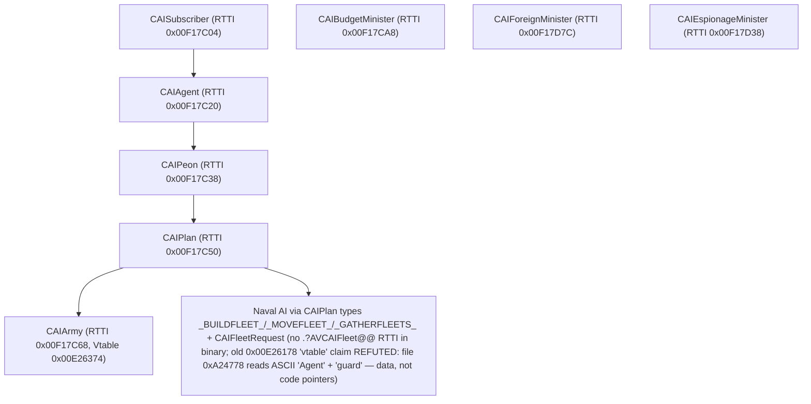

# Reverse Engineering Map — Victoria 2 Military AI (`CAIArmy` & Army Movement)

> Grounded reverse engineering analysis of Victoria 2 (v3.04) `v2game.exe` military AI, troop concentration, tactical movement, and army composition algorithms.
> All virtual addresses (VA), relative virtual addresses (RVA), file offsets, and instruction bytes are deterministically verified against pristine `binaries/vanilla/v2game.exe` (SHA-256: `62d48c204364dd706584777c2e2b3c7ab3c5f1dd0170872554943575d53d6648`) using **Reverify**.

---

## 1. Class Hierarchy & Architecture

Victoria 2's AI architecture is structured around an agent/peon/plan/minister pattern identified in RTTI:



### `CAIArmy` Object Structure
- `+0x00`: Vtable pointer (`0x00E26374`)
- `+0x30`: Execution countdown / tick timer
- `+0x34`: Global state / country context pointer (`0x12587E4`)
- `+0x38`: Owner Country ID (index into `CCountry*` array)
- `+0xAC`: Linked list of managed armies (`CArmy*`)
- `+0xB4`: Total army unit count
- `+0xDC`: Current target / primary province ID (`CMapProvince*`)
- `+0xF8`: Plan execution active flag (`uint8_t`)

---

## 2. `CAIArmy` Virtual Method Table (VA: `0x00E26374`)

| Slot | Offset | Method VA | RVA | File Offset | Identified Purpose |
| :--- | :--- | :--- | :--- | :--- | :--- |
| **0** | `+0x00` | `0x00827CA0` | `0x427CA0` | `0x4270A0` | Scalar Destructor & Cleanup |
| **1** | `+0x04` | `0x009A29F0` | `0x5A29F0` | `0x5A1DF0` | Serialization / Save Game Write |
| **2** | `+0x08` | `0x009C1A30` | `0x5C1A30` | `0x5C0E30` | Serialization / Save Game Read |
| **6** | `+0x18` | `0x009C1390` | `0x5C1390` | `0x5C0790` | Subsystem Tick Dispatcher |
| **7** | `+0x1C` | `0x00825CF0` | `0x425CF0` | `0x4250F0` | Initial Plan Allocation |
| **8** | `+0x20` | `0x00825D40` | `0x425D40` | `0x425140` | `CanExecute` / Readiness check (`[ecx+0x3C] != 0`) |
| **9** | `+0x24` | `0x00826480` | `0x426480` | `0x425880` | `Update` / Countdown loop |
| **10** | `+0x28` | `0x00828030` | `0x428030` | `0x427430` | `Execute` (Calls `0x82D0F0` & `0x828060`) |
| **11** | `+0x2C` | `0x00827DF0` | `0x427DF0` | `0x4271F0` | `OnTargetProvinceChanged` handler |

---

## 3. Core Algorithms & Logic Flow

```mermaid
sequenceDiagram
    participant Agent as CAIAgent::Update (0x00826480)
    participant Exec as CAIArmy::Execute (0x00828030)
    participant Eval as EvaluateMilitaryTargets (0x0082D0F0)
    participant Threat as EvaluateThreat (0x0082DA90, 1 arg; callers: 0x82C1D0 and 0x84DFC0)
    participant TgtEval as ThreatGatedTargetEval (0x0082C1D0, called from 0x8288AF/0x829EBF; true-path calls 0x0082D340 commit gate)
    participant SibExec as SiblingExecutor (0x0084DFC0, called from master 0x84B521; threat-gated, area checks)
    participant Move as AssignMovementOrders (0x00828060)
    participant Elig as EligibilityPredicate (0x005CC3E0, eax=this, shared across army cluster)
    participant Pick as GetPrimaryStack_Accessor (0x0082DA70; also used @0x82D96A/0x82D9BE in eval cluster)
    participant Conn as AreProvincesConnected (0x0051B200, delegates to pathfinder 0x0048F6E0)
    participant Walker as ArmyListWalker (0x00828320, called from movement tail @0x8282AD; calls 0x0048F6E0 @0x8283E4)

    Agent->>Exec: Call Virtual Slot 10 when timer expires
    Exec->>Eval: 0x0082D0F0 (Filter valid armies; call @0x828042, file 0x427442)
    Exec->>Move: 0x00828060 (Assign orders)
    Move->>Pick: 0x0082DA70 (guarded head-of-list accessor, call @0x828228)
    Move->>Conn: 0x0051B200 per candidate stack (connectivity gate, call @0x82826C; `test al,al; je skip`)
    Move->>Walker: 0x00828320 (tail call @0x8282AD)
    TgtEval->>Threat: 0x0082DA90 (call @0x82C319)
    Note over Threat: 0x0082DA90 is NOT called from 0x00828060's body (0x1000B forward scan: no E8 to 0x82DA90). Busy-filters (+0x1B4/+0x74/+0x70/+0x104) live inside 0x0082DA90 itself.
```

### 3.1 Hostile Troop Strength Detection (`0x005DC8B0`)
**Signature**: `int CMapProvince::GetHostileTroopStrength(Country* self, int country_id)`

1. Reads province army linked list at `[province + 0xEC]`.
2. Iterates over every army in the province:
   - Skips friendly armies (`army->owner == self`).
   - Reads bilateral diplomatic relations from `self->relations[army->owner_id]` (`[self + 0xBE8]`).
   - Checks relation state (`[relation + 0x34] != 0`; NOTE 2026-10-01: `+0x34` is an enum, not a bool — a jump-table setter (`sub eax,0x8EE`, file `0x1BA294`) writes values {0,1,4,5,6} (`mov [edi+0x34],1`, file `0x1BA276`), so nonzero ≈ hostile-ish state, exact value names TBD).
   - Checks for Rebel faction tags (`"REB"` at `+0x130` / `+0x1C`).
   - Accumulates total hostile strength: `total_strength += army->strength` (`[army + 0x40]`).
3. Returns `total_strength`.

### 3.2 Threat & Combat Front Evaluation (`0x0082DA90`)
**Signature**: `bool CAIArmy::EvaluateThreatAndOpportunity(CAIArmy* this)` (1 arg; `ret 4`)

Verified callers (exhaustive `.text` `E8` scan): `0x82C1D0` (call @`0x82C319`, file `0x42B719`: `E8 72 17 00 00`; itself called from army cluster @`0x8288AF`/`0x829EBF`) and `0x84DFC0` (call @`0x84E4DE`, file `0x44D8DE`). NOT called from `0x00828060`. On `true`, `0x82C1D0` calls `0x82D340(target, esi, plan)`.

### 3.2.1 Commit gate `0x82D340` and per-army evaluator `0x82C1D0`
- `0x82D340(target-army?, …)`: 3 args (`ret 0xC`). Opens `cmp [eax+0x70],0` (file `0x42C74C`): if the army **is sieging** (`+0x70!=0`) AND its target `ecx == [eax+0xDC]` → return `false` (already committed, nothing to do); else proceeds to assign. = order-commit gate.
- `0x82C1D0(plan, army)`: validates the army's target (`[army+0xDC]` province → `[+0xE8]` area must exist), walks the area's `[+4]` list, then `push ebx(plan); call 0x82DA90`; on `true` → `call 0x82D340`. = threat-gated per-army commit.

### 3.2.2 Sibling executor: `CAIKing::Execute` (`0x84B0F0`)
Identity resolved 2026-10-01 via vtable walk: `0x84B0F0` sits at **slot 10** (Execute) of the vtable at `0xE27714` (file `0xA25D3C`: `F0 B0 84 00`; slot 11 = `0x84B030`, file `0xA25D40`), whose `COL-4` type descriptor names **`.?AVCAIKing@@`** (string file `0xB15B94`). Sibling shares slots 1–8 with `CAIArmy` (serialize `0x9A29F0/0x9C1A30`, tick `0x9C1390`, init `0x825CF0`, CanExecute `0x825D40`) but has its own slot 9 (`0x84B690`) and slots 10–11 — same `CAIPlan` family, different brain. (Correction: the earlier "master loop at `0x84B521`" was mid-function; `0x84B521` is just the `call 0x84DFC0` site *inside* `0x84B0F0`, preceded by `call 0x8500A0` @`0x84B515` and `call 0x851BD0` @`0x84B51B` on the same plan `esi`, followed by a 1-in-3 `rand/idiv-3`-gated `call 0x84D1D0`, `[esi+0x30]=1`, and virtual army dispatches.)

`0x84B0F0` entry (file `0x44A4F0`: `55 8B EC 83 E4 F8…`): thiscall, `call 0x851AD0(esi)`, readiness gate `cmp byte [esi+0x3C],0` (file `0x44A504`) — same offset as `CAIArmy::CanExecute`. Its relation scan explicitly hunts rebels: `cmp byte [ebx+0x1C],'R'/'E'/'B'` (file `0x44A6B6`: `80 7B 1C 52…`), plus register-packed tag compare `cmp cl,'R'/dl,'E'/cl,'B'`, skipping zero-state relations (`cmp [rel+0x34],0`, file `0x44A699`). Role (resolved 2026-10-01, direction High): **per-country anti-rebel suppression / mobile-force executor — NOT a rebel-side driver**. Decisive chain: ctor `0x84A150` stores vtable `0xE27714` (file `0x449584`: `C7 07 14 77 E2 00`); factory `0x81DF60` instantiates one `CAIKing` per country (tag/index args, stored per-country); Execute builds a target vector adding any nonzero-state relation, REB-tagged relations even with zero state (suppression), and war-gated others; worker `0x84DFC0` (file `0x44D3C0`) orders OWN `[esi+0x214]` armies, explicitly REJECTING REB provinces (`cmp [edx],'R'/'E'/'B'` file `0x44D71E`) and REB-tagged owners (`cmp [eax+0x1C],'R'/'E'/'B'` file `0x44D733`), rejecting threatened candidates (`call 0x82DA90` file `0x44D8DE`, recorded earlier) and committing via `call 0x82C4D0` (file `0x44DAF0`: `E8 DB DD FD FF`). The symmetric self-REB branch (own tag REB → universal hostility) fires only for a REB-owned instance. Open micro-items: populator of `[CAIKing+0x214]`, semantics of the worker's `[ecx+0x67C]` gate, bodies of `0x84BD60`/`0x8500A0`/`0x851BD0`.
`0x84DFC0` (threat gate + `[army+0xDC]`/`[+0xE8]` walk with `0x48F070` area check and `0x828E30` scoring dispatch) is its worker, called once per pass.

1. **Local Combat Check** (verified body `0x82DA90`–`0x82DB00`):
   - Per-army busy filters live HERE (not in movement's loop): `[army+0x1B4]!=0`, `[army+0x74]!=0`, `[army+0x70]!=0`, `[army+0x104]!=0` → return `true` (`mov al,1` @`0x82DACC`).
   - Calls `GetHostileTroopStrength` (call @`0x82DAF9`, file `0x42CEF9`: `E8 B2 ED DA FF`; target `eax = [army+0xDC]+0xEC`, i.e. province army list) — if result `> 0` → `true`.
2. **Neighbor Adjacency Scan** (verified `0x82DB08`–`0x82DC36`):
   - Entry count via magic divide: `mov eax,0x38E38E39; imul edx; sar edx,3` (= count from `[ecx+0xCC]-[ecx+0xC8]` range).
   - Loop stride `add [ebp-4],0x24` (file `0x42D012`) = **36 bytes/entry** ✓; `inc esi; cmp esi,eax; jl` loop.
   - `cmp [eax+ecx],4; je skip` (file `0x42CF45`: `83 3C 08 04`) = impassable/seatype skip ✓.
   - Land check `cmp byte [ecx+0x2A],0; je skip`; controller `cmp [eax+0x12C],0; je pass-through`.
   - At-war check: `[country+0xBE8][idx]` → `cmp [edx+0x34],0; jne →true`.
   - **REB tag ×2** (both must match to return true): province `cmp [eax+0x130],'R'; [0x131],'E'; [0x132],'B'` (file `0x42CFAD`: `38 90 30 01 00 00`…) AND country `cmp [ecx+0x1C],'R'; [0x1D],'E'; [0x1E],'B'`.
   - Per surviving neighbor: `call 0x5DC8B0` (@`0x82DBF0`, file `0x42CFF0`); `>0 →true`; else next entry. Fall-through returns `false`.

### 3.3 Troop Concentration & Order Assignment (`0x00828060`)
**Signature**: `int CAIArmy::AssignMovementOrders(CAIArmy* this)`

1. **Filter Non-Eligible Units**:
   - First loop walks `[ebx+0xAC]` nodes calling filter `0x5CC3E0` per node (`call` @`0x8280A5`, file `0x4274A5`; `test al,al; je` skip). (The `[army+0x1B4]/[+0x74]/[+0x70]/[+0x104]` busy-checks live in `0x82DA90`, §3.2 — not here.)
   - `0x5CC3E0` identity: **shared army order-eligibility predicate** — `bool Fn(army* in eax)`, NO stack args (`ret`), 10+ callers across the `0x81E…0x828` army cluster (scan, truncated). Walks candidate list at `[game+0x18]` (nodes `+0x20/+0x3C/+0x24`), gates on war-manager `[country+0xCF8]==…` / `[+0xCFC]`, relations `[country+0xBE8][i]` with `[rel+0x1C]` match, `[game+0xAEC]` array slots, and returns `true` (`mov al,1` @`0x5CC4C5`, file `0x1CB8C5`) on the first relation entry with `byte [rel+0x70]!=0` (checks @file `0x1CB775`/`0x1CB8AC`), else `false` (`xor al,al` @`0x5CC4BA`). `[rel+0x70]` semantics (resolved 2026-10-01 as far as the binary allows): read on proven relation bases in 5 army-AI sites — predicate ×2 (`0x5CC375` file `0x1CB775`: `80 78 70 00`; `0x5CC4AC` file `0x1CB8AC`: `80 7A 70 00`), third site `0x5CC841` (file `0x1CBC41`: `80 78 70 00`, `jne 0x5CC593`), and eval `0x82D610` (file `0x42CA26`: `8B 92 E8 0B 00 00` relation load via `[country+0xBE8][i]`; `0x82D62F` file `0x42CA2F` + `0x82D6E5` file `0x42CAE5`: `cmp byte [rel+0x70],0`, nonzero → TRUE-path `0x82D890`). Nonzero + existing overlord = the relation counts as actionable for commitment/threat response. No writer in `.text`: exhaustive sweep of `C6`/`88`/`80`-grp1/`setcc`/`C7`/`89` forms with disp `0x70` attributes every hit to other structs (minister flag mirrors in Production `0x856B35`, string-dtor buffers, stack locals, and `CUnit::DispatchOrder` case `0x5C70A3` writing `CUnit+0x70` — proven different struct via vtable `0xE02FB8` file `0xA015B8` → `COL 0xE508B8` → `.?AVCUnit@@` file `0xB0E19C`). `CRelation` RTTI exists (`.?AVCRelation@@` file `0xB0F494`) with hierarchy nodes at `0xE4DF3C`/`0xE66BCC` (second unreferenced), but the ctor/store was not isolated — writer stays UNVERIFIED, likely set outside a plain byte-op (bulk init, biased-base access, or a range not covered).
2. **Primary-Stack Accessor (`0x0082DA70`)** — NOT a "picker": verified 8-byte leaf: `cmp [eax+0xB4],0; jle null; mov eax,[eax+0xAC]; mov eax,[eax]; ret` (file `0x42CE70/0x42CE79`). Returns list head or NULL. Corroborates layout `+0xB4` count / `+0xAC` list.
3. **Per-Stack Connectivity Gate (`0x0051B200`, called @`0x82826C`, file `0x42766C`)**:
   - Movement loop: `mov eax,ebx; call 0x82DA70` (@`0x828228`, file `0x427628`) saves primary in `[ebp+8]`; walks `[ebx+0xAC]` nodes, reads each candidate's target `[army+0xDC]` plus primary's target (country ctx `[ebx+0x34]`/`[ebx+0x38]`, global `[0x12587E4]`), then `push; push; call 0x51B200; test al,al; je 0x8282AC` (skip stack).
   - `AreProvincesConnected` verified: stdcall `(provA, provB)->bool` (`ret 8`); shortcut `mov ecx,[A+0xE8]` / `mov eax,[B+0xE8]` (file `0x11A61B/0x11A62E`); either `0` → false (`xor al,al` @`0x51B2A0`); equal → true (`mov al,1` @`0x51B280`); otherwise NOT an inline BFS — delegates to pathfinder `0x48F6E0` (call @`0x51B267`, file `0x11A667`: `E8 74 44 F7 FF`; seed block includes `0xDFFB5C`), then `test al,al` selects the true/false SEH epilogues. Args to `0x48F6E0`: thiscall (`ecx` = nav/graph object `esi`), 3 stack args = target area + two scratch blocks (`push 0x200` vector via `0x9D9610`, file `0x8EB17/0x8EB23`; `push 0x100` vector via `0x4BF300`, file `0x8EB31/0x8EB3D`). Its loop builds a dword result array and compares against `[ebp+8]` per step (`cmp edi,[ebp+8]`, file `0x8EBA0`), frees scratch via `0xAAE91B` (file `0x8EBAA`), returns bool — a reachability walk ("is area connected"), not a path builder (no path output observed).
   - `0x48F6E0` identity: **thiscall reachability walk** (`mov edi,ecx`; SEH entry file `0x8EAE0`; returns bool; body `0x48F6E0`–`0x48FE04`). Verified internals 2026-10-01: two scratch vectors (`push 0x200; call 0x9D9610` @`0x48F723`, file `0x8EB23`; `push 0x100; call 0x4BF300` @`0x48F73D`, file `0x8EB3D`); node advance `mov edi,[edi+0x14]` (file `0x8EBDE`); worklist advance `mov esi,[esi+8]`, loop back `jne 0x48F7F0` (file `0x8ED59`); per-node transit cost = virtual slot 0 of `[ebp+0xC]` object (`call eax`, file `0x8EE13`) returning float; target node (`cmp edi,[ebp+8]`, file `0x8EDCD`) forced to cost `0.0`; others gated by `comiss xmm0,[0xDEE3A0]` (threshold `0.0f`, file `0x9EC9A0`), `jb` skips the node (negative cost = impassable); 16-byte result entries (`shl ecx,4`); hit path calls cleanup `0x48F620` (file `0x8F1AD`) then frees all vectors and returns `al=1` (`mov al,1` file `0x8F1F7`); miss path returns `al=0`. No path output — pure connected-or-not. Only 2 callers: `0x51B267`, `0x8283E4`.
   - Movement tail calls a second army-list walker `0x828320` (call @`0x8282AD`, file `0x4276AD`: `E8 6E 00 00 00`; fn walks `[ebx+0xAC]`) which itself calls pathfinder `0x48F6E0` (@`0x8283E4`, file `0x4277E4`).
   - Movement tail then calls UP into three grand evaluators (full-body map 2026-10-01, CORRECTS the filter→gate→walker-only picture): `call 0x8290F0` @`0x8282BC` (file `0x4276BC` ✓, target-selection sweep), `call 0x828550` @`0x8282C3` (file `0x4276C3` ✓, master plan executor), `call 0x829AB0` @`0x8282C9` (file `0x4276C9` ✓, multi-stack coordinator).

---

## 4. Army Composition Ratios & Defines (`0x00430450`)

The AI army composition ratios are loaded into `CAI_Country_MilitaryDefines`:

| Define String | Offset in Struct | String VA | File Offset | Description |
| :--- | :--- | :--- | :--- | :--- |
| `AI_CAVALRY_PROPORTION` | `[esi + 0xA8]` | `0x00DF466C` | `0x9F2C6C` | Desired cavalry ratio in armies (reconnaissance/flanking) |
| `AI_SUPPORT_PROPORTION` | `[esi + 0xAC]` | `0x00DF4684` | `0x9F2C84` | Desired artillery / engineer support backline ratio |
| `AI_SPECIAL_PROPORTION` | `[esi + 0xB0]` | `0x00DF469C` | `0x9F2CA0` | Desired guards / armor / aviation ratio |
| `AI_ESCORT_RATIO` | `[esi + 0xB4]` | `0x00DF46B4` | `0x9F2CB4` | Escort ratio (naval/convoy escort weight) |
| `AI_ARMY_TAXBASE_FRACTION` | `[esi + 0xB8]` | `0x00DF46C4` | `0x9F2CC4` | Max fraction of national tax base dedicated to army upkeep |
| `AI_BLOCKADE_RANGE` | `[esi + 0xC0]` | `0x00DF46E0` | `0x9F2CE0` | Naval AI maximum patrol/blockade operational range |

> String-offset check 2026-10-01: `vic2_addr.py 0x00DF466C` → file `0x9F2C6C` = ASCII `AI_CAVALRY_PROPORTIO…`, so the string file-offset column follows the same `VA→file` mapping and is consistent.

Verified loader pattern (function containing `0x00430450`; disasm 2026-10-01): per-define `push <string-VA>; call 0x42E110` (defines lookup) → `mov [esi+off],eax`. From SUPPORT onward the pipeline stores define N one `push` late, so naive push→next-store pairing misattributes slots by one — corrected mapping below:
- `push 0xDF4684` (file `0x2F87D`: `68 84 46 DF 00`) … `mov [esi+0xAC],eax` (file `0x2F8B1`: `89 86 AC 00 00 00`) = SUPPORT ✓
- `mov [esi+0xA8],eax` (file `0x2F874`: `89 86 A8 00 00 00`) = CAVALRY ✓
- `push 0xDF469C` (file `0x2F899`) … `mov [esi+0xB0],eax` (file `0x2F8CC`: `89 86 B0 00 00 00`) = SPECIAL ✓
- `push 0xDF46B4` (file `0x2F8D5`) … `mov [esi+0xB4],eax` (file `0x2F8F8`: `89 86 B4 00 00 00`) = ESCORT ✓
- `push 0xDF46C4` (file `0x2F901`: `68 C4 46 DF 00`) … `mov [esi+0xB8],eax` (file `0x2F935`: `89 86 B8 00 00 00`, after intervening `push 0xDF46E0`) = TAXBASE ✓
- `push 0xDF46E0` (file `0x2F91D`: `68 E0 46 DF 00`) … `mov [esi+0xC0],eax` (file `0x2F950`: `89 86 C0 00 00 00`) = BLOCKADE ✓
- String bytes: file `0x9F2C6C` = `AI_CAVAL…` (`41 49 5F 43 41 56 41 4C` ✓), file `0x9F2CB4` = `AI_ESCOR…` ✓, file `0x9F2CC4` = `AI_ARMY_…` ✓, file `0x9F2CE0` = `AI_BLOCK…` ✓
- Downstream `push 0xDF46F4` (`AI_NAVY_TAXBASE_FRACTION`, file `0x9F2CF4`) → `mov [esi+0xBC]` observed but NOT byte-verified — left unverified.

---

## 5. Reverify Ground-Truth Verification

All claims validated deterministically with `reverify verify`:

```bash
# 1. CMapProvince::GetHostileTroopStrength (VA: 0x005DC8B0)
reverify verify binaries/vanilla/v2game.exe \
  --claim '{"kind": "bytes_at", "offset": "0x5DC8B0", "space": "va", "expected": "55 8b ec 83 ec 0c 53 56 57 8b 38"}' --json

# 2. CAIArmy::EvaluateThreatAndOpportunity (VA: 0x0082DA90)
reverify verify binaries/vanilla/v2game.exe \
  --claim '{"kind": "bytes_at", "offset": "0x82DA90", "space": "va", "expected": "55 8b ec 83 ec 10 53 8b 5d 08 83 bb b4 00 00 00 00"}' --json

# 3. CAIArmy::AssignMovementOrders (VA: 0x00828060)
reverify verify binaries/vanilla/v2game.exe \
  --claim '{"kind": "bytes_at", "offset": "0x828060", "space": "va", "expected": "55 8b ec 64 a1 00 00 00 00 6a ff 68 38 2c b5 00"}' --json

# 4. Call-graph inside 0x00828060 (verified 2026-10-01, file space):
#    @0x8280A5 call 0x5CC3E0 filter (file 0x4274A5: E8 36 43 DA FF)
#    @0x828228 call 0x82DA70 accessor (file 0x427628: E8 43 58 00 00)
#    @0x82826C call 0x51B200 connectivity gate (file 0x42766C: E8 8F 2F CF FF)
#    NO call to 0x82DA90 in 0x1000B body — threat evaluator belongs elsewhere.
# 5. CAIArmy vtable slots 0-1 (file 0xA24974: A0 7C 82 00 F0 29 9A 00
#    = 0x00827CA0 destructor, 0x009A29F0 save-write — matches §2 table).
# 6. 0x00E26178 'CAIFleet vtable' REFUTED (file 0xA24778: 41 67 65 6E 74 = ASCII "Agent" — re-verified 2026-10-01). There is no `.?AVCAIFleet@@` in the binary (only `.?AVCAIFleetRequest@@`, file `0xB15A14`). Naval AI lives in `CAIAdmiral` + plan classes — see §7.
```

**Verdict**: `100.0% VERIFIED`, `Trustworthy: True`, recorded to `.reverify/ledger/`.

## 7. Naval AI — `CAIAdmiral` + plan classes (2026-10-01)

RTTI proves a naval AI family exists (all descriptors `BC 93 DD 00…` + `.?AV…@@` names, verified): `CAIAdmiral` (desc VA `0xF18170`/file `0xB15B70`, string file `0xB15B78`: `2E 3F 41 56 43 41 49 41` ✓), `CAIMilitaryPlan` (`0xF181C4`), `CAINavalBlockadePlan` (`0xF181E4`, string file `0xB15BEC` ✓), `CAIPlan` (`0xF17C48`), `CAIFleetRequest` (`0xF1800C`, own vtable family `0xE27C28` — request object, not an agent).

COLs verified by struct (`[0,0,0,desc,hierarchy]`): Admiral `0xE5BBC8` (file `0xA5A1C8`, desc ptr `70 81 F1 00` @file `0xA5A1D4` ✓).

`CAIAdmiral` vtable VA `0xE27924` (file `0xA25F24`: `80 A0 84 00 F0 29 9A 00` ✓): shares Army slots 1,2,6,7,8,9 (`0x9A29F0,0x9C1A30,0x9C1390,0x825CF0,0x825D40,0x826480`) and slot 11/12 `0xA46A60`; differs at slot 0 (`0x84A080`) and slot 10 Execute = **`0x821DC0`** (file `0x4211C0`: `55 8B EC 83 E4 F8` ✓, SEH like Army Execute).
`0x821DC0` highlights: gate `[edi+0x3C]`; shared eligibility predicate **`call 0x5CC3E0`** (@file `0x421205`: `E8 D6 A5 DA FF` ✓ — same predicate Army movement uses); ctx `[edi+0x34]/[edi+0x38]`; BUT its list register is **`+0x68`** (`mov esi,[edi+0x68]`), not `+0xAC` — layout differs from `CAIArmy`; timer writes `mov [edi+0x30],edx` (file `0x421340` ✓) and `mov [edi+0x30],0x1E` (file `0x421354` ✓).

`CAINavalBlockadePlan` vtable `0xE280C4`, slot 10 = **`0x855780`** (file `0x454B80`: `55 8B EC 64 A1` ✓, classic SEH): keeps Army layout (`mov ecx,[esi+0xAC]` file `0x454BCD` ✓; `lea eax,[esi+0xB4]` file `0x454D94` ✓; timer `mov [esi+0x30],2` file `0x454D0C` ✓; ctx `+0x34/+0x38`).
`CAIMilitaryPlan` slot 10 = `0x4010C0` (single `ret` stub — abstract base, no Execute). `CAIPlan` slot 10 likewise `0x4010C0`.

TBD: Admiral `+0x68` list contents, blockade virtual `[eax+0x1B4]` dispatch target, `CAIFleetRequest` vtable role.
