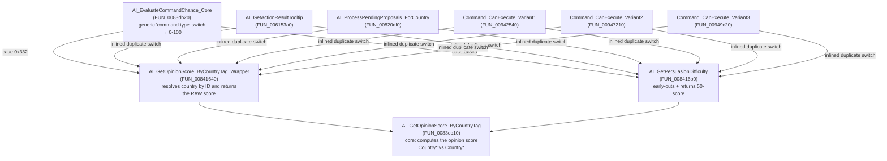

# Reverse-Engineering Map — `AI_GetOpinionScore_ByCountryTag` (formerly `FUN_0083ec10`)

> Working document for the Victoria 2 native-mod reverse-engineering report.
> Confidence level shown for each proposed name: **High** (direct evidence in the code), **Medium** (inferred from pattern/context), **Low** (speculative).

---

## 1. Call-graph overview



**Pattern found:** there is a single block of logic ("how likely is the AI to accept/allow this action?") that appears **duplicated verbatim** in 6 different places in the binary (`FUN_0083db20`, `FUN_006153a0`, `FUN_00820df0`, `FUN_00942540`, `FUN_00947210`, `FUN_00949c20`). This is typical of an old MSVC compiler that **inlined/duplicated** a small function used from many UI call-sites instead of emitting one shared function — every diplomacy widget's "OnUpdate"/"OnClick" carries its own copy of the switch.

---

## 2. `AI_GetOpinionScore_ByCountryTag` (FUN_0083ec10) — the core

**Signature:** `void AI_GetOpinionScore_ByCountryTag(Country* self, Country* other, int* out_score, bool verbose)`

- `param_1` = evaluating country ("self")
- `param_2` = evaluated country ("other")
- `param_3` = pointer to the score accumulator (integer, starts uninitialized — every block does `*param_3 += N`, or, in the very first case, `*param_3 = N` directly)
- `param_4` = "verbose" flag: if `0`, only the number is computed; if non-zero, the function also builds `AIREASON_*` reason strings for a diplomacy tooltip.

### 2.1 Evaluation blocks (execution order)

| # | Approx. offset | Condition | Effect on score | AIREASON / confidence |
|---|---|---|---|---|
| 1 | `0x0083EC37`–`0x0083EEB8` | `self` has an active overlord/vassal (`+0xcf4`/`+0xcf5`) **and** that overlord/vassal matches `other` (`+0xcfc == other+0x20`) | `*score = 1000` (direct assignment, short-circuits the rest) | `AIREASON_OVERLORD` — **High** (string confirmed in the binary) |
| 2 | `0x0083EEE4`–`0x0083F146` | Same overlord check but it does **not** match (`+0xcfc != other+0x20`) | `*score = -1000` | No AIREASON confirmed yet, same vassalage block — **High** |
| 3 | `0x0083F146`–`0x0083F2CA` | `self` has its own overlord (`+0x142c`) that isn't `other`, and `other` is a "great power"/civilized (`+0x31`) | `*score = -1000` | Cross-vassalage penalty — **Medium** |
| 4 | `0x0083F2CA`–`0x0083F55D` | `self` appears in `other`'s "known vassals" list (walks `other+0xda8..0xdac`) | `*score = -1000` | Indirect subordination relation — **Medium** |
| 5 | `0x0083F55D`–`0x0083F76C` | Cross sphere-of-influence check (`+0x156c`, fields `+0x14`/`+0x18`) between both countries | jumps to `LAB_008414B8` (sphere-rivalry block) → `*score += -1000` with a dedicated reason | Penalty for "being in the rival's sphere" — **Medium** |
| 6 | `0x0083F76C`–`0x0083F8DE` | `self`'s colonial rank is below the minimum required by `defines.country.COLONIAL_RANK` | `*score = -1000` | Blocked by insufficient colonial rank — **Medium** |
| 7 | `0x0083F8DE`–`0x0083FA47` | Counts how many of `self`'s and `other`'s provinces/states have overlords that differ from each other (accumulated into `iStack_8c`/`iStack_18`, plus "is GP" flags into `iStack_14`/`iStack_20`) | sets up counters used further down (no direct addition) | Setup of vassalage-conflict counters — **High** (clear logic) |
| 8 | `0x0083FA47`–`0x0083FAE0` | Walks `self`'s "reports"/relations list (`+0xce4`), counting how many are of type `0x332` (same ID that triggers wrapper A) with subtype `3` | increments `iStack_14` | Related to active "0x332"-type agreements — **Medium** |
| 9 | `0x0083FAE0`–`0x0083FAE0`+ | Same but over `other`'s list | increments `iStack_20` | same as above — **Medium** |
| 10 | `0x0083FAFB`–`0x0083FC84` | If `other` has NO overlord (`+0x20`) and `self`/`other` don't share an overlord, and the `DAT_012588e8+0xb94` flag is NOT active: if `other` is a GP (`+0x31`) and `iStack_14>0` → `*score = -1000`; if `self` is a GP and `iStack_20>0` → `*score = -1000` | penalty for "interfering with a GP's vassals" | **Medium** |
| 11 | `0x0083FC84`–`0x0083FF39` | Variant with the `DAT_012588e8+0xb94` flag active: if both are GPs and `iStack_14==0 && iStack_20==0` → `*score += 0x32` (**+50**) | bonus for "no vassalage conflicts between great powers" | **Medium** |
| 12 | `0x0083FF39`–`0x0083FF6E` | Calls `FUN_00834150` (a "base" relation score, likely the stored `opinion`/`relation` value between the two countries) | `*score += FUN_00834150(...)` | "Accumulated bilateral relation" component — **High** that it's a sub-computation, exact name pending |
| 13 | `0x0083FF71`–`0x0084022E` | Computation using a pseudo-random hash over `FUN_004fb6a0()` (likely a deterministic RNG seeded per country pair) normalized to a `[-25, +∞)` range, doubled if either party isn't civilized | `*score += rng_component` (roughly −25 to −1 or more negative) | "AI personality/randomness factor" — **Medium** |
| 14 | `0x0084022E`–`0x008403D0` | If `other` has no overlord and has its own overlord ≠ `self`: penalty proportional to `-(iStack_8c+iStack_18)*10` | `*score += penalty` | Penalty from accumulated vassalage conflicts — **Medium** |
| 15 | `0x008403D0`–`0x00840531` | If flag `cStack_25` was set (set in block #7 via `FUN_0042bb00`, likely "at war with...") | `*score += 0x14` (**+20**) | Bonus for "common allies/war" — **Low/Medium** |
| 16 | `0x00840531`–`0x00840889` | Computes **two military-strength ratios** (`FUN_005dcbd0` on offsets `+0x7b4` of each country — likely army/navy size) via 64-bit division, compares against a threshold (`DAT_01317d3c`), and walks `self`'s vassal list (`+0x3a4`) looking for matching "borrowed"/allied armies | `*param_4 += 5/10/15/20` depending on the ratio | Bonus for relative military superiority — **Medium** |
| 17 | `0x00840889`–`0x00840944` | Converts the two prior ratios into an "interest" factor (uses float constants `0x461C4200`≈9950 and `0x459C4400`≈5000, and `SignedInt64_Divide`) | computes `iStack_14` (max 10) and `param_4`(max 5) | "Economic" bonus/malus, possibly trade or debt — **Low** |
| 18 | `0x00840944`–`0x00840AB0` | If `self` is "civilized" (`+0x67c`): recomputes the ratios using a different pair of lists (`+0xda8`/`+0xd58`, distinct from above) and scales the bonus/malus against thresholds `DAT_01317d08/d28/d84` | economic-interest adjustment for civilized nations | **Low** |
| 19 | `0x00840AB0`–`0x00840FC1` | Adds the final interest (blocks 17/18) to the score | `*score += interest` | — |
| 20 | `0x00840FC1`–`0x00841168` | If `other` is "civilized" (`+0x67c`): walks a global list of "special modifiers" (`DAT_012588e8+0xb3c`) calling `FUN_00832dd0(self, other)` for each, accumulating an integer that can be negative | `*score += Σ special modifiers` (only reported in verbose if negative) | Global event/decision modifiers — **Medium** |
| 21 | `0x00841168`–`0x00841307` | Walks the "reasons" list at `self+0xbe8[other]+0x50` calling a virtual (`+0x1c`) on each; if **any** returns `true` | `*score -= 100` | Penalty from a dynamic "rejection reason" condition (possibly an active casus belli/grievance held by `self` against `other`) — **Medium** |
| 22 | `0x00841307`–end | Same pattern reversed (`other+0xbe8[self]`) | `*score -= 10` | Symmetric, milder penalty — **Medium** |

### 2.2 Design notes

- The function **can always short-circuit**: if `param_4 == 0` (silent mode), any block that hits a hard-cutoff condition `return`s immediately after setting `*param_3`, without generating text. This is an optimization for cases where only the number is needed (e.g., to decide accept/reject) without spending time on `format_and_assign_string_member` calls.
- Blocks 1–6 are **mutually exclusive, hard-cutoff** (±1000): they represent "hard" vassalage/sphere-of-influence conditions that dominate any other computation.
- Blocks 7 onward are **cumulative** and represent the "fine-grained" opinion: military, economic, historical (accumulated relation), and one-off event/decision modifiers.
- The repeated pattern of `string_assign_from_buffer_member` / `format_and_assign_string_member` + `ResolverORegistrarEvento` + `FUN_009a9880` + `FUN_00448aa0` in every block is the machinery that builds **localized reason strings** (`AIREASON_*`) making up the diplomacy tooltip, exactly like the already-confirmed `AIREASON_OVERLORD` block.

---

## 3. The two direct wrappers

### 3.1 `AI_GetOpinionScore_ByCountryTag_Wrapper` (FUN_00841640) — confidence **High**

```c
Country* self = LookupCountryByID(this /* struct with 2 IDs */, [ebp+0x10]);
Country* other = ResolveOtherCountry(this, [ebp+0x10]);
int score;
AI_GetOpinionScore_ByCountryTag(self, other, &score, [ebp+0x8] /* verbose */);
return score; // RAW, untransformed
```

- No early-outs. It only resolves pointers by ID against the global country table and delegates.
- Used when the caller **wants the actual number** (for UI/tooltip, or logic that compares against different thresholds depending on the case).

### 3.2 `AI_GetPersuasionDifficulty` (FUN_008416b0) — confidence **High**

```c
if (!FUN_0092ede0(self,other) ...)          // diplomatic compatibility check
if (other's overlord == self) return default;
if (!self.is_civilized) return default;
count = count_matches(self.issues, other.tag);
if (count > 2) return 100;                  // hard block, NEVER calls the core

int score;
AI_GetOpinionScore_ByCountryTag(self, other, &score, /*verbose=*/0);
return 50 - score;                          // inverts the scale
```

- The early-outs (`compatibility`, `overlord`, `civilized`, `count>2`) avoid the full computation when the answer is already obvious (total block, value `100`).
- The `return 50 - score` turns "high score = good relation" into **"low score = easy to persuade"**, compatible with a dice roll like `rand()%100 < result`.

---

## 4. The "command dispatcher" family (giant switch)

The 6 functions (`FUN_0083db20`, `FUN_006153a0`, `FUN_00820df0`, `FUN_00942540`, `FUN_00947210`, `FUN_00949c20`) share **the same switch** over a "command/action type" ID obtained from a virtual call `(**(code**)(*obj + 0x20))()` (likely `GetCommandType()`/`GetActionID()` on a polymorphic "diplomatic request" or "issue" object).

### 4.1 Switch case table (identical in all 6 copies)

| ID (hex) | ID (dec) | Called function | Relation to what's already mapped |
|---|---|---|---|
| `0x81e` | 2078 | `FUN_0083de70` | — |
| `0x332` | 818 | **`AI_GetOpinionScore_ByCountryTag_Wrapper`** (FUN_00841640) | direct core call, raw score |
| `0x38d` | 909 | (no call — direct shortcut to "accepted", `goto LAB_...dc` ≈ 100) | — |
| `0x470` | 1136 | inline: threshold on `param_1[0xb]`/`param_1[10]` (treasury or similar?) | — |
| `0x897`/`0x898` | 2199/2200 | `FUN_00911760` (boolean) → 0 or 100 | — |
| `0x8c6` | 2246 | `FUN_008419c0` | — |
| `0x8c7` | 2247 | `FUN_00842a00` | — |
| `0x8c8` | 2248 | `FUN_00842a50` | — |
| `0x8c9` | 2249 | `FUN_008430d0` | — |
| `0x8ca` | 2250 | **`AI_GetPersuasionDifficulty`** (FUN_008416b0) | wrapper with early-outs, 50-score |
| `0x8cb` | 2251 | `FUN_00841900` | — |
| `0x8d5` | 2261 | `FUN_00844050` | — |
| `0x8d6` | 2262 | `FUN_00844140` | — |
| `0x9fa` | 2554 | `FUN_00843a10` | — |
| `0x9fb` | 2555 | `FUN_00843b90` | — |
| `0xa02` | 2562 | `FUN_00843170` | — |
| default | — | result `0` | unrecognized/unsupported action |

**Interpretation:** this is almost certainly a **generic "will the AI accept this action of type X?" dispatcher**, used by many different screens (diplomacy, decisions, elections, trade, etc.). Each command ID corresponds to a different type of diplomatic/political interaction, and `0x332` (→ our core `AI_GetOpinionScore_ByCountryTag`) is likely the generic case for **"improve relations" / "standard diplomatic request"**, while `0x8ca` (→ `AI_GetPersuasionDifficulty`) would be a more specific, "costlier" type of persuasion (justify war, gain influence, etc.). Without access to the game's command-constant table I can't confirm the exact names — I'd recommend cross-referencing these IDs against any command `enum`/table that shows up elsewhere in the already-reversed binary.

### 4.2 Proposed names per function

| Function | Proposed name | Justification | Confidence |
|---|---|---|---|
| `FUN_0083db20` | **`AI_EvaluateCommandChance_Core`** | The "clean" version: takes all parameters explicitly, returns `uint` 0-100, and has the final `param_7` flag deciding whether the result is **binarized** (`< 0x32 ? 0 : 100`) or returned raw. It's the "reference" implementation the other 5 copy/inline with variations. | High |
| `FUN_006153a0` | **`AI_GetActionResultTooltip`** | Receives `param_1` as an output string buffer (same `[ebp+0x14]/[ebp+0x10]` pattern as the `std::string`s elsewhere in the binary) and calls `FUN_00615690(param_1, 0 or 100)` — builds a result text (likely "Yes"/"No" or the value itself) instead of just returning the number. Uses `in_EAX` as an implicit "this" (evaluating country). | Medium-High |
| `FUN_00820df0` | **`AI_ProcessPendingProposals_ForCountry`** | Unlike the rest, this isn't a simple "check" — it **walks a list** (`param_1+0x34` → countries → `+0xce4`, the same "reports" list seen in the core) filtering by state `piVar2[9]==1` ("pending"), computes the acceptance % with the same switch, rolls a dice (`FUN_00ab047b()%100 < chance`), and **sets the outcome** (`piVar2[9] = 2` rejected / `3` accepted), notifying via callback. This is the function that actually **resolves** a country's pending diplomatic proposals, not just evaluates them. | High |
| `FUN_00942540` | **`Command_CanExecute_DiplomacyScreen`** (tentative, pending screen ID) | Returns `bool`, uses `FUN_00911760` (a "are we the player"/multiplayer check) to decide whether to generate tooltip text (`ResolverORegistrarEvento`), and finally returns `param_1[0x19]==0` — the classic "widget enabled by state flag" pattern. | Medium |
| `FUN_00947210` | **`Command_CanExecute_Variant2`** | Structurally identical to `FUN_00942540` but with a different stack layout and an extra "badboy"/infamy check (`+0x67`) before deciding the tooltip. Likely a different screen/button sharing the same logic (e.g. faction/alliance window vs. sphere window). | Medium |
| `FUN_00949c20` | **`Command_CanExecute_Variant3`** | The most complex of the three: besides the switch, it computes an accumulated "prestige/interest cost" (`iStack_310`, with date conversions via `DAT_012586dc+8` and `DAT_012588e8+0xb0c` — these look like game timestamps) and builds a final formatted number text (`+`/`-`) via `DAT_00e356b4`. Likely the button for an action with a **time-varying cost** (e.g. "join faction" with a growing prestige cost). | Medium-Low |

> Note: I can't reliably tell the three `Command_CanExecute_*` apart without seeing which GUI screen/button references each one (the XREFs you have only show the call address, not the context of which button triggers each). If you ever find the GUI text strings (`.gui`) or the event name that fires each handler, the naming can be refined.

---

## 5. What this represents in the game

Taken together, this subsystem is the engine behind:

1. **The % shown in diplomacy tooltips** ("Chance of Acceptance") when the player hovers over an action toward another nation.
2. **The AI's actual decision** to accept or reject a pending player proposal (through `AI_ProcessPendingProposals_ForCountry`, which rolls the dice using the exact same score).
3. A **catalog of ~15 "diplomatic command/decision" types** (the switch IDs), of which only two (`0x332` and `0x8ca`) go through the generic opinion core we've fully mapped; the rest use dedicated logic (`FUN_00842a00`, `FUN_00843170`, etc.) still pending analysis.

## 6. Suggested next steps for the report

- [ ] Confirm the AIREASON string for block 2 (overlord mismatch) and for the sphere-of-influence block (block 5) — there should be another `DAT_00e26a??` string.
- [ ] Reverse `FUN_00834150` (base bilateral relation score) — it's the "heaviest" component in normal gameplay time.
- [ ] Reverse `FUN_004fb6a0` (source of the "random/personality factor" — possibly a deterministic seed per country pair).
- [ ] Map the switch IDs (`0x332`, `0x8ca`, etc.) against any already-known command/decision table for the game to confirm real names instead of generic ones.
- [ ] Confirm the exact differences between `Command_CanExecute_Variant1/2/3` by checking the `.gui` strings referencing these addresses (if Ghidra has data xrefs into these functions from UI callback tables).
