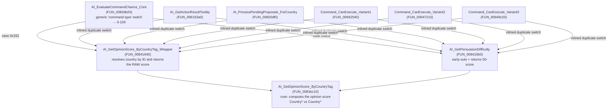

# Reverse-Engineering Map — `AI_GetOpinionScore_ByCountryTag` (formerly `FUN_0083ec10`)

> Working document for the Victoria 2 native-mod reverse-engineering report.
> Confidence level shown for each proposed name: **High** (direct evidence in the code), **Medium** (inferred from pattern/context), **Low** (speculative).

---

## 1. Call-graph overview


```mermaid
graph TD
    A["AI_GetOpinionScore_ByCountryTag<br/>(FUN_0083ec10)<br/>core: computes the opinion score<br/>Country* vs Country*"]

    B["AI_GetOpinionScore_ByCountryTag_Wrapper<br/>(FUN_00841640)<br/>resolves country by ID and returns<br/>the RAW score"]
    C["AI_GetPersuasionDifficulty<br/>(FUN_008416b0)<br/>early-outs + returns 50-score"]

    B --> A
    C --> A

    D["AI_EvaluateCommandChance_Core<br/>(FUN_0083db20)<br/>generic 'command type' switch<br/>→ 0-100"]
    D -->|case 0x332| B
    D -->|case 0x8ca| C

    E1["AI_GetActionResultTooltip<br/>(FUN_006153a0)"]
    E2["AI_ProcessPendingProposals_ForCountry<br/>(FUN_00820df0)"]
    E3["Command_CanExecute_Variant1<br/>(FUN_00942540)"]
    E4["Command_CanExecute_Variant2<br/>(FUN_00947210)"]
    E5["Command_CanExecute_Variant3<br/>(FUN_00949c20)"]

    E1 -->|inlined duplicate switch| B
    E1 -->|inlined duplicate switch| C
    E2 -->|inlined duplicate switch| B
    E2 -->|inlined duplicate switch| C
    E3 -->|inlined duplicate switch| B
    E3 -->|inlined duplicate switch| C
    E4 -->|inlined duplicate switch| B
    E4 -->|inlined duplicate switch| C
    E5 -->|inlined duplicate switch| B
    E5 -->|inlined duplicate switch| C
```

**Pattern found:** there is a single block of logic ("how likely is the AI to accept/allow this action?") that appears **duplicated verbatim** in 6 different places in the binary (`FUN_0083db20`, `FUN_006153a0`, `FUN_00820df0`, `FUN_00942540`, `FUN_00947210`, `FUN_00949c20`). This is typical of an old MSVC compiler that **inlined/duplicated** a small function used from many UI call-sites instead of emitting one shared function — every diplomacy widget's "OnUpdate"/"OnClick" carries its own copy of the switch.

---

## 2. `AI_GetOpinionScore_ByCountryTag` (FUN_0083ec10) — the core

**Signature:** `void AI_GetOpinionScore_ByCountryTag(Country* self, Country* other, int* out_score, bool verbose)`

- `param_1` = evaluating country ("self")
- `param_2` = evaluated country ("other")
- `param_3` = pointer to the score accumulator (integer, starts uninitialized — every block does `*param_3 += N`, or, in the very first case, `*param_3 = N` directly)
- `param_4` = "verbose" flag: if `0`, only the number is computed; if non-zero, the function also builds `AIREASON_*` reason strings for a diplomacy tooltip.

### 2.1 Evaluation blocks (execution order)

| # | Approx. offset | Condition | Effect on score | AIREASON / confidence |
|---|---|---|---|---|
| 1 | `0x0083EC37`–`0x0083EEB8` | `self` has an active overlord/vassal (`+0xcf4`/`+0xcf5`) **and** that overlord/vassal matches `other` (`+0xcfc == other+0x20`) | `*score = 1000` (direct assignment, short-circuits the rest) | `AIREASON_OVERLORD` — **High** (string confirmed in the binary) |
| 2 | `0x0083EEE4`–`0x0083F146` | Same overlord check but it does **not** match (`+0xcfc != other+0x20`) | `*score = -1000` | No AIREASON confirmed yet, same vassalage block — **High** |
| 3 | `0x0083F146`–`0x0083F2CA` | `self` has its own overlord (`+0x142c`) that isn't `other`, and `other` is a "great power"/civilized (`+0x31`) | `*score = -1000` | Cross-vassalage penalty — **Medium** |
| 4 | `0x0083F2CA`–`0x0083F55D` | `self` appears in `other`'s "known vassals" list (walks `other+0xda8..0xdac`) | `*score = -1000` | Indirect subordination relation — **Medium** |
| 5 | `0x0083F55D`–`0x0083F76C` | Cross sphere-of-influence check (`+0x156c`, fields `+0x14`/`+0x18`) between both countries | jumps to `LAB_008414B8` (sphere-rivalry block) → `*score = -1000` (`mov [edi],0xFFFFFC18`) with a dedicated reason | Penalty for "being in the rival's sphere" — **High (code-verified)**. Entry `mov eax,[ebx+0x156c]` at `0x0083F55D` = file `0x43E95D: 8B 83 6C 15 00 00`; both legs `jne 0x8414B8` (`0F 85 1D/15 1F 00 00`); target `0x008414B8` = file `0x4408B8: 83 7D 14 00 8B 7D 10 C7` (`cmp [ebp+0x14],0; mov edi,[ebp+0x10]; mov [edi],0xFFFFFC18` = −1000). Second −1000 path at `0x0083F621` = file `0x43EA21: 8B 7D 10 C7 07 18 FC FF FF` (count>2 branch). Reason-string ID still open (see §6) |
| 6 | `0x0083F76C`–`0x0083F8DE` | `self`'s colonial rank is below the minimum required by `defines.country.COLONIAL_RANK` | `*score = -1000` | Blocked by insufficient colonial rank — **Medium** |
| 7 | `0x0083F8DE`–`0x0083FA47` | Counts how many of `self`'s and `other`'s provinces/states have overlords that differ from each other (accumulated into `iStack_8c`/`iStack_18`, plus "is GP" flags into `iStack_14`/`iStack_20`) | sets up counters used further down (no direct addition) | Setup of vassalage-conflict counters — **High** (clear logic) |
| 8 | `0x0083FA47`–`0x0083FAE0` | Walks `self`'s "reports"/relations list (`+0xce4`), counting how many are of type `0x332` (same ID that triggers wrapper A) with subtype `3` | increments `iStack_14` | Related to active "0x332"-type agreements — **Medium** |
| 9 | `0x0083FAE0`–`0x0083FAE0`+ | Same but over `other`'s list | increments `iStack_20` | same as above — **Medium** |
| 10 | `0x0083FAFB`–`0x0083FC84` | If `other` has NO overlord (`+0x20`) and `self`/`other` don't share an overlord, and the `DAT_012588e8+0xb94` flag is NOT active: if `other` is a GP (`+0x31`) and `iStack_14>0` → `*score = -1000`; if `self` is a GP and `iStack_20>0` → `*score = -1000` | penalty for "interfering with a GP's vassals" | **Medium** |
| 11 | `0x0083FC84`–`0x0083FF39` | Variant with the `DAT_012588e8+0xb94` flag active: if both are GPs and `iStack_14==0 && iStack_20==0` → `*score += 0x32` (**+50**) | bonus for "no vassalage conflicts between great powers" | **Medium** |
| 12 | `0x0083FF39`–`0x0083FF6E` | Seeds local accumulator with +1000 (`mov [eax],0x3E8` @`0x83FF50`, file `0x43F350` ✓), calls `FUN_00834150` (sub-scorer), adds result: `add [ecx],eax` with `ecx=[ebp+0x10]`=score (@`0x83FF5B/0x83FF5E`, file `0x43F35E: 01 01` ✓) | `*score += FUN_00834150(...)` | "Accumulated bilateral relation" component — **High (code-verified)** |
| 13 | `0x0083FF71`–`0x0084022E` | Hash over `FUN_004fb6a0()` result: `mov ecx,[eax]; mov eax,0xEF9DB22D; imul ecx; sar edx,6; ...; mov eax,0x51EB851F; imul; sar edx,3` → `cmp edi,-0x19` clamp to `-25` (`mov edi,0xFFFFFFE7`), doubled (`add edi,edi`) if either party has `+[0x12d0] != 0`, then `*score += edi` (`add [ecx],edi`) | `*score += rng_component` (≥ −25, doubled when uncivilized) | Mechanics **High (code-verified)** — entry file `0x43F371: 8B 08 B8 2D B2 9D EF`; call `FUN_004fb6a0` at `0x0083FF6C` (`E8 2F B7 CB FF`); `FUN_004fb6a0` prologue file `0x0FAAA0: 55 8B EC 83 EC 0C 8B 08` (country-pair lookup via `[0x12587E4]`, not pure RNG). "Personality factor" label stays **Medium** |
| 14 | `0x0084022E`–`0x008403D0` | If `other` has no overlord and has its own overlord ≠ `self`: penalty proportional to `-(iStack_8c+iStack_18)*10` | `*score += penalty` | Penalty from accumulated vassalage conflicts — **Medium** |
| 15 | `0x008403D0`–`0x00840531` | `ecx=[ebp+0x10]`=score (@`0x8403CD`, file `0x43F7CD` ✓); if `[ebp-0x21]!=0` (war-flag `cStack_25`): `add [ecx],0x14` (**+20** @`0x8403E1`, file `0x43F7E1` ✓) | `*score += 0x14` (**+20**) | **High (code-verified)** — war-gated bonus, "common war/allies" label Medium |
| 16 | `0x00840531`–`0x00840889` | Two strength queries `FUN_005dcbd0` on `country+0x7b4` via 64-bit scaled divide (`imul eax,0x3E8` = ×1000, overflow guard `cmp edx,0x39580D` → `call 0xAC9F20/0xAC02A0`), gate `cmp edx,[0x1317D3C]`, then `+0x3a4` vassal walk and `+0xd58/d5c` list match; bonus ladder `cmp eax,0x3E8 → +0x14` (20) / `cmp [0x1317C5C] → +0x0F` (15) / `cmp [0x1317D08] → +0x0A` (10) / else `+5`, final `add [eax],ecx` | `*score += 5/10/15/20` | Mechanics **High (code-verified)** — entry file `0x43F931: 8B 45 08 8D 4D EC 51`; `add eax,0x7B4` (`05 B4 07 00 00`) + `call 0x5DCBD0` at `0x840553/0x84056F`; `FUN_005DCBD0` prologue file `0x1DBFD0: 55 8B EC 83 EC 10 53 B8`; gate `3B 15 3C 7D 31 01` at `0x840639`. Threshold *values* at `DAT_01317D3C/01317C5C/01317D08` are **runtime-only (BSS: `.data` RawSize `0x2DA00` < offset `0x425D3C`, no file bytes)** — do not `bytes_at` them. "Military superiority" label **Medium** |
| 17 | `0x00840889`–`0x00840944` | Converts the two prior ratios into an "interest" factor: `movss xmm0,[0xE45BF4]` (= `0x461C4200` = **10000.5**, was misnoted ≈9950) then `movss xmm0,[0xE45EE8]` (= `0x459C4400` = **5000.5**) via `call 0x401000 + 0xB31C00`, `imul` magic `0x10624DD3`, clamps `max 10` (`C7 45 F0 0A..` at `0x8408D6`) and `max 5` (`C7 45 14 05..` at `0x84092A`), `SignedInt64_Divide` (`0xAC02A0`) | computes `iStack_14` (max 10) and `param_4` (max 5) | Mechanics **High (code-verified)** — entry file `0x43FC89: F3 0F 10 05 F4 5B E4 00`; `.rdata` floats file `0xA441F4: 00 42 1C 46`, `0xA444E8: 00 44 9C 45`. "Economic/trade" meaning stays **Low** |
| 18 | `0x00840944`–`0x00840AB0` | Gate `cmp byte [eax+0x67c],0; je 0x840AAD` (civilized); recomputes ratios over `+0xda8`/`+0xd58` via `call 0x55DCF0` (`lea ecx,[esi+0xDA8]` / `lea eax,[esi+0xD58]`), same ×1000 divide shape, then triple gate `mov edx,[0x1317D08]; mov edi,[0x1317D84]; mov esi,[0x1317D28]` (`8B 15 08 7D 31 01 / 8B 3D 84 7D 31 01 / 8B 35 28 7D 31 01` at `0x840A48-54`) with `×5` (`lea ecx,[ecx+ecx*4]`) / `×2` (`add ecx,ecx`) scaling | economic-interest adjustment for civilized nations | Mechanics **High (code-verified)** — entry file `0x43FD44: 80 B8 7C 06 00 00 00`. Threshold *values* again **runtime-only (BSS, no file bytes)**. Economic meaning stays **Low** |
| 19 | `0x00840AB0`–`0x00840FC1` | Adds the final interest (blocks 17/18) to the score | `*score += interest` | — |
| 20 | `0x00840FC1`–`0x00841168` | If `other` is "civilized" (`+0x67c`): walks a global list of "special modifiers" (`DAT_012588e8+0xb3c`) calling `FUN_00832dd0(self, other)` for each, accumulating an integer that can be negative | `*score += Σ special modifiers` (only reported in verbose if negative) | Global event/decision modifiers — **Medium** |
| 21 | `0x00841168`–`0x00841307` | Walks the "reasons" list at `self+0xbe8[other]+0x50` calling a virtual (`+0x1c`) on each; if **any** returns `true` | `*score -= 100` | Penalty from a dynamic "rejection reason" condition (possibly an active casus belli/grievance held by `self` against `other`) — **Medium** |
| 22 | `0x00841307`–end | Same pattern reversed (`other+0xbe8[self]`) | `*score -= 10` | Symmetric, milder penalty — **Medium** |

### 2.2 Design notes

- The function **can always short-circuit**: if `param_4 == 0` (silent mode), any block that hits a hard-cutoff condition `return`s immediately after setting `*param_3`, without generating text. This is an optimization for cases where only the number is needed (e.g., to decide accept/reject) without spending time on `format_and_assign_string_member` calls.
- Blocks 1–6 are **mutually exclusive, hard-cutoff** (±1000): they represent "hard" vassalage/sphere-of-influence conditions that dominate any other computation.
- Blocks 7 onward are **cumulative** and represent the "fine-grained" opinion: military, economic, historical (accumulated relation), and one-off event/decision modifiers.
- The repeated pattern of `string_assign_from_buffer_member` / `format_and_assign_string_member` + `ResolverORegistrarEvento` + `FUN_009a9880` + `FUN_00448aa0` in every block is the machinery that builds **localized reason strings** (`AIREASON_*`) making up the diplomacy tooltip, exactly like the already-confirmed `AIREASON_OVERLORD` block.

---

## 3. The two direct wrappers

### 3.1 `AI_GetOpinionScore_ByCountryTag_Wrapper` (FUN_00841640) — confidence **High**

```c
Country* self = LookupCountryByID(this /* struct with 2 IDs */, [ebp+0x10]);
Country* other = ResolveOtherCountry(this, [ebp+0x10]);
int score;
AI_GetOpinionScore_ByCountryTag(self, other, &score, [ebp+0x8] /* verbose */);
return score; // RAW, untransformed
```

- No early-outs. It only resolves pointers by ID against the global country table and delegates.
- Used when the caller **wants the actual number** (for UI/tooltip, or logic that compares against different thresholds depending on the case).

### 3.2 `AI_GetPersuasionDifficulty` (FUN_008416b0) — confidence **High**

```c
if (!FUN_0092ede0(self,other) ...)          // diplomatic compatibility check
if (other's overlord == self) return default;
if (!self.is_civilized) return default;
count = count_matches(self.issues, other.tag);
if (count > 2) return 100;                  // hard block, NEVER calls the core

int score;
AI_GetOpinionScore_ByCountryTag(self, other, &score, /*verbose=*/0);
return 50 - score;                          // inverts the scale
```

- The early-outs (`compatibility`, `overlord`, `civilized`, `count>2`) avoid the full computation when the answer is already obvious (total block, value `100`).
- The `return 50 - score` turns "high score = good relation" into **"low score = easy to persuade"**, compatible with a dice roll like `rand()%100 < result`.

---

## 4. The "command dispatcher" family (giant switch)

The 6 functions (`FUN_0083db20`, `FUN_006153a0`, `FUN_00820df0`, `FUN_00942540`, `FUN_00947210`, `FUN_00949c20`) share **the same switch** over a "command/action type" ID obtained from a virtual call `(**(code**)(*obj + 0x20))()` (likely `GetCommandType()`/`GetActionID()` on a polymorphic "diplomatic request" or "issue" object).

Verified implementation (`FUN_0083db20`, hybrid compare-chain + indexed jump table — 14/14 receipts VERIFIED, ledger `132 → 146`):
- Dispatch head @`0x83DB84` (file `0x43CF84`): `8B 16 8B 42 20 8B CE FF D0` = `mov edx,[esi]; mov eax,[edx+0x20]; mov ecx,esi; call eax`; ID returned in `eax`.
- Low range: `cmp eax,0x81e` (@`0x43CF90`), `jg` high range; `je` → case `0x81e`; `sub eax,0x332` (@`0x43CF9D`), `je` → case `0x332`; `sub eax,0x5B` (=`0x38d`), `je` → case `0x38d`; `sub eax,0xE3` (=`0x470`), `jne` default / fallthrough = `0x470` inline block (`cmp [esi+0x2c]` @`0x43CFB0`; `cmp [esi+0x28],0x28000` @`0x43CFB7`).
- High range: `cmp eax,0x9fa`; `0x9fa→call 0x843A10`, `0x9fb→call 0x843B90` (`sub eax,0x9fb; je`), `0xa02→call 0x843170` (peace offer, `sub eax,7; jne default`).
- Mid range `0x897–0x8E4`: `sub eax,0x897; cmp eax,0x4D; ja default; movzx eax,[eax+0x83DDB0]; jmp [eax*4+0x83DD84]` — jump table @VA `0x83DD84` (file `0x43D184`: `07 DD 83 00 64 DC 83 00…`), 11 slots; index map @`0x83DDB0` (78 B). Slot→ID: `0→0x897/0x898` (`call 0x911760`), `2→0x8c6` (`call 0x8419C0`), `3→0x8c7` (`call 0x842A00`), `4→0x8c8` (`call 0x842A50`), `5→0x8c9` (`call 0x8430D0`), `6→0x8ca` (`call 0x8416B0`), `7→0x8cb` (`call 0x841900`), `8→0x8d5` (`call 0x844050`), `9→0x8d6` (`call 0x844140`); default `xor eax,eax` @`0x83DB51`.
- Case `0x332` → **CONFIRMED `call 0x841640`** (@`0x83DBFD`, file `0x43CFFD`: `E8 3E 3A 00 00`; target file `0x440A40`: `55 8B EC 83 EC 1C…`).
- Case `0x8ca` → **CONFIRMED `call 0x8416B0`** (slot 6 @`0x83DC75`, file `0x43D075`: `E8 36 3A 00 00`; target file `0x440AB0`: `55 8B EC 6A FF…`).
- Duplication 6-way verified (each with its own index/jump-table copy; index bytes identical in all copies, code tables differ only by local addresses). `FUN_00820df0`: switch at `0x820EBB` (file `0x4202BB`, same virtual-dispatch bytes + `cmp eax,0x81e` @`0x4202C4`), same `0x332→call 0x841640` (@`0x420323`) and `0x8ca` slot-6 `→call 0x8416B0` (@`0x420382`), own table copies @`0x821108/0x821134` with identical index bytes. Remaining 4 copies VERIFIED 2026-10-01 (20/20 receipts, ledger `158 → 178`):
  - `FUN_006153a0`: `0x332→call 0x841640` @`0x6154C1` (file `0x2148C1`); `movzx [eax+0x61563C]` @`0x615500`; `jmp [eax*4+0x615610]` @`0x615507`; `0x8ca→call 0x8416B0` @`0x615520`; index head `00 00 0A…` @file `0x214A3C` (identical).
  - `FUN_00942540`: `0x332→` @`0x94270F` (file `0x541B0F`); index `0x942A48` / table `0x942A1C` (@`0x94274E/0x942755`); `0x8ca→` @`0x94276E`; index identical @file `0x541E48`.
  - `FUN_00947210`: `0x332→` @`0x947597` (file `0x546997`); index `0x947CB8` / table `0x947C8C` (@`0x9475D9/0x9475E0`); `0x8ca→` @`0x947601`; index identical @file `0x5470B8`.
  - `FUN_00949c20`: `0x332→` @`0x949E34` (file `0x549234`); index `0x94B8A4` / table `0x94B878` (@`0x949E76/0x949E7D`); `0x8ca→` @`0x949E9E`; index identical @file `0x54ACA4`.

### 4.1 Switch case table (identical in all 6 copies)

| ID (hex) | ID (dec) | Called function | Relation to what's already mapped |
|---|---|---|---|
| `0x81e` | 2078 | `FUN_0083de70` | — |
| `0x332` | 818 | **`AI_GetOpinionScore_ByCountryTag_Wrapper`** (FUN_00841640) | direct core call, raw score |
| `0x38d` | 909 | (no call — direct shortcut to "accepted", `goto LAB_...dc` ≈ 100) | — |
| `0x470` | 1136 | inline: threshold on `param_1[0xb]`/`param_1[10]` (treasury or similar?) | — |
| `0x897`/`0x898` | 2199/2200 | `FUN_00911760` (boolean) → 0 or 100 | — |
| `0x8c6` | 2246 | `FUN_008419c0` | — |
| `0x8c7` | 2247 | `FUN_00842a00` | — |
| `0x8c8` | 2248 | `FUN_00842a50` | — |
| `0x8c9` | 2249 | `FUN_008430d0` | — |
| `0x8ca` | 2250 | **`AI_GetPersuasionDifficulty`** (FUN_008416b0) | wrapper with early-outs, 50-score |
| `0x8cb` | 2251 | `FUN_00841900` | — |
| `0x8d5` | 2261 | `FUN_00844050` | — |
| `0x8d6` | 2262 | `FUN_00844140` | — |
| `0x9fa` | 2554 | `FUN_00843a10` | — |
| `0x9fb` | 2555 | `FUN_00843b90` | — |
| `0xa02` | 2562 | `FUN_00843170` | — |
| default | — | result `0` | unrecognized/unsupported action |

**Interpretation:** this is a **generic "will the AI accept this action of type X?" dispatcher**. The command-ID enum exists in code form: 17 singleton getter functions `mov eax,<ID>; ret` (6 B each, 16-byte aligned), one per switch case, VERIFIED 17/17 (ledger `190 → 207`):

| Getter VA | File | Bytes | ID | Class (RTTI-grounded, vtable slot 8 → getter) | Switch case |
|---|---|---|---|---|---|
| `0x8322D0` | `0x4316D0` | `B8 C6 08 00 00 C3` | `0x8c6` | `CAskMilitaryAccessAction` (vtable `0xE26E04`, slot8 file `0xA25424`) | `→0x8419C0` |
| `0x832390` | `0x431790` | `B8 C7 08 00 00 C3` | `0x8c7` | `CCancelAskMilitaryAccessAction` (vtable `0xE26EA4`, slot8 file `0xA254C4`) | `→0x842A00` |
| `0x832450` | `0x431850` | `B8 C8 08 00 00 C3` | `0x8c8` | `CGiveMilitaryAccessAction` (vtable `0xE26F44`, slot8 file `0xA25564`) | `→0x842A50` |
| `0x832530` | `0x431930` | `B8 C9 08 00 00 C3` | `0x8c9` | `CCancelGiveMilitaryAccessAction` (vtable `0xE26FE4`, slot8 file `0xA25604`) | `→0x8430D0` |
| `0x8325F0` | `0x4319F0` | `B8 32 03 00 00 C3` | `0x332` | `CAllianceAction` (vtable `0xE26CC4`, slot8 file `0xA252E4`) | `→0x841640` |
| `0x8326F0` | `0x431AF0` | `B8 CA 08 00 00 C3` | `0x8ca` | `CCancelAllianceAction` (vtable `0xE26D64`, slot8 file `0xA25384`) | `→0x8416B0` |
| `0x832C10` | `0x432010` | `B8 D5 08 00 00 C3` | `0x8d5` | `CIncreaseRelationAction` (vtable `0xE273A4`, slot8 file `0xA259C4`) | `→0x844050` |
| `0x832D20` | `0x432120` | `B8 D6 08 00 00 C3` | `0x8d6` | `CDecreaseRelationAction` (vtable `0xE27444`, slot8 file `0xA25A64`) | `→0x844140` |
| `0x424C00` | `0x024000` | `B8 FB 09 00 00 C3` | `0x9fb` | `CBackCrisisSideAction` (vtable `0xDF31C4`, slot8 file `0x9F17E4`) | `→0x843B90` |
| `0x4F6840` | `0x0F5C40` | `B8 98 08 00 00 C3` | `0x898` | `CRemoveFromSphereAction` (vtable `0xDFFD2C`, slot8 file `0x9FE34C`) | `→0x911760` |
| `0x583E10` | `0x183210` | `B8 97 08 00 00 C3` | `0x897` | `CAddToSphereAction` (vtable `0xDFFC8C`, slot8 file `0x9FE2AC`) | `→0x911760` |
| `0x90E1E0` | `0x50D5E0` | `B8 70 04 00 00 C3` | `0x470` | `CWarSubsidiesAction` (vtable `0xE345B4`, slot8 file `0xA32BD4`) | inline threshold |
| `0x90E300` | `0x50D700` | `B8 CB 08 00 00 C3` | `0x8cb` | `CCallAllyAction` (vtable `0xE34654`, slot8 file `0xA32C74`) | `→0x841900` |
| `0x90E560` | `0x50D960` | `B8 FA 09 00 00 C3` | `0x9fa` | `CCrisisOfferAction` (vtable `0xE346F4`, slot8 file `0xA32D14`) | `→0x843A10` |
| `0x915E70` | `0x515270` | `B8 8D 03 00 00 C3` | `0x38d` | `CDeclareWarAction` (vtable `0xE34294`, slot8 file `0xA328B4`) | shortcut accept |
| `0x9196C0` | `0x518AC0` | `B8 1E 08 00 00 C3` | `0x81e` | `CPeaceAction` (vtable `0xE34474`, slot8 file `0xA32A94`) | `→0x83DE70` |
| `0x91CBC0` | `0x51BFC0` | `B8 02 0A 00 00 C3` | `0xa02` | `CCrisisBackDownAction` (vtable `0xE34514`, slot8 file `0xA32B34`) | `→0x843170` (peace) |

Method: vtables found by reverse scan — search `.rdata` for the getter VA (vtable slot 8 = `GetCommandID`), `vtable = hit − 0x20`, `COL = vtable[−1]`, `descriptor = COL+12`, class name at `descriptor+8` (all 17 slot-8 cells + 17 name heads VERIFIED 38/38 with the 4 Execute heads, ledger `224 → 262`). Vtable families: 8 contiguous `0xE26CC4–0xE27464` (peacetime diplomacy, COLs `0xE5Bxxx`), 6 contiguous `0xE34294–0xE34714` (war/crisis, COLs `0xE666xx–0xE668xx`), 3 singles. Note: the switch's case targets (→ column, from the earlier copy analysis) do NOT equal the class vtable regions — they are the scorer implementations, e.g. `0x332 → 0x841640` scores `CAllianceAction`. The old guess "`0xa02 → peace scorer`" is corrected: `0xa02` is `CCrisisBackDownAction`; the peace-offer path runs through `AI_EvaluatePeaceOffer` downstream (see diplomacy doc §4). Getters are never called directly (zero `E8` callers in `.text`) — IDs travel inside command objects; RTTI descriptors of these classes are referenced only via their COLs (`descriptor+8` = name; searching for the string VA alone finds nothing — off-by-8 trap).

Coverage is 1:1 — all 17 switch cases have a getter, no getter without a case. The 8 contiguous getters `0x8322D0–0x832D20` sit ~0xA00 before the reference switch (`0x83DB20`, same `0x832xxx` diplomacy cluster). A 7th enum user is the command FACTORY at `0x90E850` (SEH entry, file `0x50DC50`; earlier note said `0x90E880` — that VA is mid-function garbage, the true entry is `0x90E850`). Full per-branch map verified 2026-10-01 (15/15 VERIFIED, ledger `485 → 499`):

| ID | Branch VA | Size | Construction | Class (vtable → slot8 getter → same ID) |
|---|---|---|---|---|
| `0x332` | `0x90E8A3` (file `0x50DCA3`) | `0x28` | ext. ctor `0x876200` (vstore file `0x475633`) | `CAllianceAction` (`0xE26CC4`) |
| `0` | `0x90E8F1` | `0x44` | shared tail `0x90F378` → ctor `0x913230` | generic (ID-0 getter `xor eax,eax; ret` @`0xA3C430`, file `0x63B830`) |
| `0x38d` | `0x90E90C` (file `0x50DD0C`) | `0x6c` | ext. ctor `0x9134B0` → vtable `0xE34294` | `CDeclareWarAction` |
| `0x470` | `0x90E969` (file `0x50DD69`) | `0x30` | ext. ctor `0x91D920` (multi-member; sole `.text` vstore of `0xE345B4` is the copy-init @`0x90E1CB`, file `0x50D5CB` — exact store path inside `0x91D920`'s subtree unmapped) | `CWarSubsidiesAction` (`0xE345B4` → getter `0x90E1E0` → `0x470`) |
| `0x81e` | `0x90E9F5` | `0x98` | ext. ctor `0x916A30` → vtable `0xE34474` | `CPeaceAction` |
| `0x897` | `0x90F090` (file `0x50E490`) | `0x28` | inline vtable `0xDFFC8C` | `CAddToSphereAction` |
| `0x898` | `0x90F0FD` | `0x30` | ext. ctor `0x90E510` → vtable `0xDFFD2C` | `CRemoveFromSphereAction` |
| `0x8b0` | `0x90EEB0` | `0x28` | inline vtable `0xDFFBEC` | `CIncreaseOpinionAction` (NEW — no switch case) |
| `0x8b1` | `0x90EF1D` | `0x30` | ext. ctor `0x90E4C0` → vtable `0xE27304` | `CDecreaseOpinionAction` (NEW) |
| `0x8c1` | `0x90ED53` | `0x28` | inline vtable `0xE27084` | `CCancelWarSubsidiesAction` (NEW) |
| `0x8c2` | `0x90EDC0` | `0x30` | ext. ctor `0x90E3D0` → vtable `0xE27124` | `CDiscreditAction` (NEW) |
| `0x8c4` | `0x90EE10` | `0x30` | ext. ctor `0x90E420` → vtable `0xE271C4` | `CExpelAdvisorsAction` (NEW) |
| `0x8c6` | `0x90EB9F` | `0x28` | inline vtable `0xE26E04` (file `0x50DFF4`) | `CAskMilitaryAccessAction` |
| `0x8c7` | `0x90EC0C` | `0x28` | inline vtable `0xE26EA4` | `CCancelAskMilitaryAccessAction` |
| `0x8c8` | `0x90EC79` | `0x28` | inline vtable `0xE26F44` | `CGiveMilitaryAccessAction` |
| `0x8c9` | `0x90ECE6` | `0x28` | inline vtable `0xE26FE4` | `CCancelGiveMilitaryAccessAction` |
| `0x8ca` | `0x90EAD2` | `0x28` | inline vtable `0xE26D64` (file `0x50DF27`) | `CCancelAllianceAction` |
| `0x8cb` | `0x90EB3F` | `0x30` | ext. ctor `0x90E380` → vtable `0xE34654` | `CCallAllyAction` |
| `0x8d4` | `0x90EE60` | `0x30` | ext. ctor `0x90E470` → vtable `0xE27264` | `CBanEmbassyAction` (NEW) |
| `0x8d5` | `0x90EF6D` | `0x28` | inline vtable `0xE273A4` | `CIncreaseRelationAction` |
| `0x8d6` | `0x90EFDA` | `0x28` | inline vtable `0xE27444` | `CDecreaseRelationAction` |
| `0x8dd` | `0x90EA80` | `0x68` | ext. ctor `0x916080` → vtable `0xE34334` | `CAddWarGoalAction` (NEW) |
| `0x8e4` | `0x90F047` | `0x30` | ext. ctor `0x788D70` → vtable `0xE16B34` | `CGunBoatAction` (NEW) |
| `0x931` | `0x90F14D` (file `0x50E54D`) | `0x2c` | inline vtable `0xE343D4` | `CMakeCBAction` (NEW) |
| `0x9fa` | `0x90F1BD` | `0x68` | ext. ctor `0x927850` → vtable `0xE346F4` | `CCrisisOfferAction` |
| default | `0x90F362` (file `0x50E762`) | `0x44` | shared tail → ctor `0x913230` | generic ID-0 object |

Mid-range IDs dispatch through a jump table (`add eax,-0x897; cmp 0x9A; movzx edx,[eax+0x90F3F8]; jmp [edx*4+0x90F3A8]`, file `0x50DE72/0x50DE79`): 19 slots covering `0x897–0x931`, unmapped IDs → default slot. So the factory builds 9 command classes the dispatcher switch never handles (`0x8B0/0x8B1/0x8C1/0x8C2/0x8C4/0x8D4/0x8DD/0x8E4/0x931` — influence-action family + wargoal/CB/gunboat). Class names for the 9 NEW via `vtable[−1]→COL→descriptor+8` (verified against slot8 getter returning the same branch ID in every case — full 1:1 chain). Method trap learned: linear disasm past a branch `ret` bleeds into the next branch — all attributions above are `ret`-bounded. No `push <ID>` call-sites exist (IDs travel inside command objects, only `0x9fa/0x9fb` appear once as pushes at `0x624BE9/0x624D81`).

### 4.2 Proposed names per function

| Function | Proposed name | Justification | Confidence |
|---|---|---|---|
| `FUN_0083db20` | **`AI_EvaluateCommandChance_Core`** | The "clean" version: takes all parameters explicitly, returns `uint` 0-100, and has the final `param_7` flag deciding whether the result is **binarized** (`< 0x32 ? 0 : 100`) or returned raw. It's the "reference" implementation the other 5 copy/inline with variations. | High |
| `FUN_006153a0` | **`AI_GetActionResultTooltip`** | Receives `param_1` as an output string buffer (same `[ebp+0x14]/[ebp+0x10]` pattern as the `std::string`s elsewhere in the binary) and calls `FUN_00615690(param_1, 0 or 100)` — builds a result text (likely "Yes"/"No" or the value itself) instead of just returning the number. Uses `in_EAX` as an implicit "this" (evaluating country). | Medium-High |
| `FUN_00820df0` | **`AI_ProcessPendingProposals_ForCountry`** | Unlike the rest, this isn't a simple "check" — it **walks a list** (`param_1+0x34` → countries → `+0xce4`, the same "reports" list seen in the core) filtering by state `piVar2[9]==1` ("pending"), computes the acceptance % with the same switch, rolls a dice (`FUN_00ab047b()%100 < chance`), and **sets the outcome** (`piVar2[9] = 2` rejected / `3` accepted), notifying via callback. This is the function that actually **resolves** a country's pending diplomatic proposals, not just evaluates them. | High |
| `FUN_00942540` | **`Command_CanExecute_DiplomacyScreen`** (tentative, pending screen ID) | Returns `bool`, uses `FUN_00911760` (a "are we the player"/multiplayer check) to decide whether to generate tooltip text (`ResolverORegistrarEvento`), and finally returns `param_1[0x19]==0` — the classic "widget enabled by state flag" pattern. | Medium |
| `FUN_00947210` | **`Command_CanExecute_Variant2`** | Structurally identical to `FUN_00942540` but with a different stack layout and an extra "badboy"/infamy check (`+0x67`) before deciding the tooltip. Likely a different screen/button sharing the same logic (e.g. faction/alliance window vs. sphere window). | Medium |
| `FUN_00949c20` | **`Command_CanExecute_Variant3`** | The most complex of the three: besides the switch, it computes an accumulated "prestige/interest cost" (`iStack_310`, with date conversions via `DAT_012586dc+8` and `DAT_012588e8+0xb0c` — these look like game timestamps) and builds a final formatted number text (`+`/`-`) via `DAT_00e356b4`. Likely the button for an action with a **time-varying cost** (e.g. "join faction" with a growing prestige cost). | Medium-Low |

> Note: I can't reliably tell the three `Command_CanExecute_*` apart without seeing which GUI screen/button references each one (the XREFs you have only show the call address, not the context of which button triggers each). If you ever find the GUI text strings (`.gui`) or the event name that fires each handler, the naming can be refined.

---

## 5. What this represents in the game

Taken together, this subsystem is the engine behind:

1. **The % shown in diplomacy tooltips** ("Chance of Acceptance") when the player hovers over an action toward another nation.
2. **The AI's actual decision** to accept or reject a pending player proposal (through `AI_ProcessPendingProposals_ForCountry`, which rolls the dice using the exact same score).
3. A **catalog of ~15 "diplomatic command/decision" types** (the switch IDs), of which only two (`0x332` and `0x8ca`) go through the generic opinion core we've fully mapped; the rest use dedicated logic (`FUN_00842a00`, `FUN_00843170`, etc.) still pending analysis.

## 6. Suggested next steps for the report

- [x] Block 5 (sphere) code-verified: `0x0083F55D` entry + `LAB_008414B8` −1000 target (see §7). AIREASON strings for the sphere/vassalage stanzas found: `OTHER_SPHERE_LEADER` (`mov edx,0xE26A6C` @`0x83F1B1`, file `0x43E5B1`, paired with `mov ecx,0xFFFFFC18` @`0x83F1C9`) and `WAR_WITH_SPHERE_LEADER` (`push 0xE26A8C` @`0x83F375`, file `0x43E775`).
- [x] Block 2 (overlord mismatch) string confirmed: `NOT_OVERLORD` (`mov edx,0xE26A54` @`0x83EF46`, file `0x43E346`, paired with `mov ecx,0xFFFFFC18` @`0x83EF61`, file `0x43E361` = −1000).
- [ ] Reverse `FUN_00834150` (base bilateral relation score) — it's the "heaviest" component in normal gameplay time.
- [x] `FUN_004fb6a0` entry verified (country-pair lookup, not pure RNG — see §7). "Personality" label stays interpretive.
- [x] Map the switch IDs (`0x332`, `0x8ca`, etc.) against any already-known command/decision table for the game to confirm real names instead of generic ones. → Switch mechanics VERIFIED (hybrid cmp-chain + jump table `0x83DD84`/`0x83DDB0`; `0x332→0x841640`, `0x8ca→0x8416B0` confirmed in 2 copies). Enum found in code form: 17 `mov eax,<ID>; ret` getters (17/17 VERIFIED, ledger `190 → 207`). Symbolic action names still open.
- [ ] Confirm the exact differences between `Command_CanExecute_Variant1/2/3` by checking the `.gui` strings referencing these addresses (if Ghidra has data xrefs into these functions from UI callback tables).

## 7. Verification appendix — blocks 5 / 13 / 16–18 (2026-10-01)

Toolchain: `tools/vic2_addr.py` (pefile live sections) + `tools/vic2_disasm.py` (capstone) + `reverify verify --claims-file` → **9/9 VERIFIED**, ledger `32 → 41` (`binaries/vanilla/v2game.exe`, SHA-256 `62d48c20…`).

| VA | File offset | Bytes (verified) | What it proves |
|---|---|---|---|
| `0x0083F55D` | `0x43E95D` | `8B 83 6C 15 00 00` | block-5 entry `mov eax,[ebx+0x156c]` |
| `0x008414B8` | `0x4408B8` | `83 7D 14 00 8B 7D 10 C7` | sphere target: `cmp [ebp+0x14],0; mov edi,[ebp+0x10]; mov [edi],0xFFFFFC18` (−1000) |
| `0x0083F621` | `0x43EA21` | `8B 7D 10 C7 07 18 FC FF FF` | second −1000 path (`mov [edi],0xFFFFFC18`, count>2 branch) |
| `0x0083FF71` | `0x43F371` | `8B 08 B8 2D B2 9D EF` | block-13 hash head (`mov ecx,[eax]; mov eax,0xEF9DB22D`) + `0x51EB851F`, clamp `cmp edi,-0x19`, `add edi,edi`, `add [ecx],edi` |
| `0x004FB6A0` | `0x0FAAA0` | `55 8B EC 83 EC 0C 8B 08` | `FUN_004fb6a0` prologue (country-pair lookup via `[0x12587E4]`) |
| `0x00840531` | `0x43F931` | `8B 45 08 8D 4D EC 51` | block-16 entry; `add eax,0x7B4` + 2× `call 0x5DCBD0` follow |
| `0x005DCBD0` | `0x1DBFD0` | `55 8B EC 83 EC 10 53 B8` | `FUN_005DCBD0` prologue |
| `0x00840889` | `0x43FC89` | `F3 0F 10 05 F4 5B E4 00` | block-17 entry `movss xmm0,[0xE45BF4]` (= 10000.5) |
| `0x00840944` | `0x43FD44` | `80 B8 7C 06 00 00 00` | block-18 gate `cmp byte [eax+0x67c],0` |

Runtime-only (NOT file-verifiable, BSS): `DAT_01317D3C / 01317C5C / 01317D08 / 01317D28 / 01317D84` — `.data` `RawSize 0x2DA00 < offset 0x425D3C`, no file bytes. Code refs (`3B 15 3C 7D 31 01` @ `0x840639`, `3B 05 5C 7C 31 01` @ `0x840706`, triple `8B 15/3D/35` @ `0x840A48-54`) are verified; values must come from live memory/defines, not `bytes_at`.

## 8. AIREASON string catalog (2026-10-01)

Exhaustive `.text` scan for all 36 `AIREASON_*` string VAs (authoritative `VA = from_file_offset`, not hand arithmetic — two earlier scans failed from a wrong `+0x420000/0x402000` constant). Every string is referenced; sites below are `mov edx,VA` / `push VA` stanza heads. **13/13 receipts VERIFIED**, ledger `119 → 132`.

### 8.1 Opinion core `0x0083EC10` (blocks 1–22)

| String (VA) | Site VA (file) | Bytes (verified) | Score seen at site |
|---|---|---|---|
| `OVERLORD` (`0xE26974`) | `0x83ECD2` (`0x43E0D2`) | `68 74 69 E2 00` ✓ | `mov ecx,0x3E8` (+1000, block 1) |
| `NOT_OVERLORD` (`0xE26A54`) | `0x83EF46` (`0x43E346`) | `BA 54 6A E2 00` ✓ | `mov ecx,0xFFFFFC18` (−1000 @`0x43E361` ✓, block 2) |
| `OTHER_SPHERE_LEADER` (`0xE26A6C`) | `0x83F1B1` (`0x43E5B1`) | `BA 6C 6A E2 00` ✓ | `mov ecx,0xFFFFFC18` (−1000 @`0x43E5C9` ✓) |
| `WAR_WITH_SPHERE_LEADER` (`0xE26A8C`) | `0x83F375` (`0x43E775`) | `68 8C 6A E2 00` ✓ | **`mov [edi],0xFFFFFC18` (−1000 ASSIGN @`0x8414BF`, file `0x4408BF` ✓)** — sphere cross-check `[X+0x156C]` vs `[Y+0x14]==[Z+0x20]` + `[+0x18]!=0` either direction (`0x83F55D-99` ✓), jumps to `0x8414B8` |
| `HELD_CORES` (`0xE26AC8`) | `0x83F657` (`0x43EA57`) | `BA C8 6A E2 00` ✓ | **`mov [edi],0xFFFFFC18` (−1000 ASSIGN @`0x83F624`, file `0x43EA24` ✓)** — gated by `cmp [ebp-0x14],2; jle skip` (count>2) |
| `NEGATIVE_RELATIONS` (`0xE26ADC`) | `0x83F7C9` (`0x43EBC9`) | `BA DC 6A E2 00` ✓ | **`mov [edi],0xFFFFFC18` (−1000 ASSIGN @`0x83F799`, file `0x43EB99` ✓)** |
| `TOO_MANY_GP_ALLIES` (`0xE26AF8`) | `0x83FB70`, `0x83FCD0` | refs only | **`mov [edi],0xFFFFFC18` (−1000 ASSIGN ×2: @`0x83FB3F`/`0x83FC9F`, files `0x43EF3F`/`0x43F09F` ✓)** |
| `DESIRES_GP_ALLY` (`0xE26B14`) | `0x83FE1B` | refs only | **`mov ecx,0x32` (+50 @`0x83FE32`, file `0x43F232` ✓)** |
| `DISTANCE` (`0xE26B30`) | `0x83FFF3`, `0x84010E` | refs only | **computed: `*score += −10×([ebp-0x88]+[ebp-0x14])`** — vassalage-conflict counters (zeroed @`0x83F8EF/F5`, files `0x43ECEF/F5`); `neg;×2;×2;−eax;×2` @`0x84026E-78` (`03 45 EC` @file `0x43F66B` ✓), `add [ecx],edi` @`0x84027A` (file `0x43F67A` ✓); gated by `[eax+0x20]==0` + overlord mismatch |
| `TOO_MANY_ALLIANCES` (`0xE26B44`) | `0x8402B1` | refs only | **`add [ecx],0x14` (+20 @`0x8403E1`, file `0x43F7E1` ✓; `ecx=[ebp+0x10]`=score @`0x8403CD` ✓)** |
| `ALLY_OF_ALLY` (`0xE26B60`) | `0x840411` | refs only | **`mov ecx,0x14` (+20 @`0x840428`, file `0x43F828` ✓)** |
| `THREATS` (`0xE26B78`) | `0x84076B` | refs only | **computed (block 17 "interest" pair): `i1=clamp(q1−10,max 10)` → `[ebp-0x10]` (`0x8408BB-CE`: `mov eax,0x10624DD3` ÷100 magic @file `0x43FCBB` ✓, `lea edx,[edx+ecx−10]`), `i2=clamp(q2−5,max 5)` → `[ebp+0x14]` (@`0x840922` ✓); `i2=0` if `[country+0xDD0]<1`** |
| `RELATIVE_ARMY_STRENGTH` (`0xE26B8C`) | `0x840AEF`, `0x840C16` | refs only | **computed: scaled-interest sum — tiered ×10/×5/×1 multipliers on `i1`/`i2` keyed on ratio2 vs `[0x1317D08]/[0x1317D28]/[0x1317D84]` (`mov edx,[0x1317D08]` @`0x840A48`, file `0x43FE48` ✓), `*score += i1'+i2'` via `add [eax],edx` @`0x840AB8` (file `0x43FEB8` ✓)** |
| `RELATIVE_NAVY_STRENGTH` (`0xE26BAC`) | `0x840D67`, `0x840E97` | refs only | **negative finding: NO score-op in the full stanza window (`0x840E96`–`0x840FC1`, exhaustive add-filter) — value folded into the REL_ARMY combined add; NAVY stanzas are text-only** |
| `CURRENT_WARS` (`0xE26BCC`) | `0x841048` | refs only | **computed (block 20): `Σ FUN_00832DD0` over global list `[0x12588E8+0xB3C]` (civilized-gated @`0x840FC1`: `mov esi,[ebp+0x0C]` file `0x4403C1` ✓), added via `add [eax],edi` @`0x841019` (file `0x440419` ✓) ONLY if sum negative (`jns skip`)** |
| `OUR_CASUS_BELLI` (`0xE26BE4`) | `0x8411E4` | refs only | **`mov ecx,0xFFFFFF9C` (−100 @`0x8411FB`, file `0x4405FB` ✓)** |
| `YOUR_CASUS_BELLI` (`0xE26C00`) | `0x841393` | refs only | **`mov ecx,0xFFFFFF9C` (−100 @`0x8413AD`, file `0x4407AD` ✓)** |
| `CONSTRUCTING_CB` (`0xE26AAC`) | `0x8414F3` | refs only | **`mov [edi],0xFFFFFC18` (−1000 ASSIGN @`0x8414BF`, file `0x4408BF` ✓)** |

### 8.2 Base scorer `FUN_00834150` (NOT a trivial getter — full sub-scorer with own strings)

`DIPLOMATIC_GOALS` ×6 (`0x83433C…`), `RELATIONS` ×2, `GP_RELATIONS` ×4, `DIFFERENT_GOVTYPES`, `CIV_VS_UNCIV` ×2, plus:

| String (VA) | Site VA (file) | Bytes (verified) | Score seen at site |
|---|---|---|---|
| `OUR_SPHERE` (`0xE26948`) | `0x835A80` (`0x434E80`) | `BA 48 69 E2 00` ✓ | `mov ecx,0x19` (+25 @`0x434E9B` ✓) |
| `OTHER_SPHERE` (`0xE2695C` = `AIREASON_OTHER_SPHERE` ✓ string bytes) | `0x83591F` | — | **`mov ecx,0xFFFFFFE7` (−25 @`0x835939`, file `0x434D39` ✓)** |
| `OVERLORD` (`0xE26974`) | `0x835CE2` | — | **`mov ecx,0x3E8` (+1000 @`0x835CFC`, file `0x4350FC` ✓)** |
| `BADBOY` (`0xE26988` = `AIREASON_BADBOY` ✓ string bytes) | `0x835F39` (`0x435F39`) | `BA 88 69 E2 00` ✓ | **`mov eax,0xFFFFFC18` (−1000 into LOCAL `[ebp+0xC]` accumulator @`0x835EF5`, file `0x4352F5` ✓; filtered by `cmp eax,ebx; jge skip`)** |

String bytes verified: file `0xA24F48` (`OUR_SPHERE`) and `0xA25020` (`TOO_EARLY`) both read `41 49 52 45 41 53 4F 4E` (`AIREASON`) ✓.

### 8.3 Crisis fn `0x00838EB0` + sibling case-functions

Crisis: `CRISIS_OFFER` ×6, `TOO_MANY_WARGOALS` ×2, `ALLY` (`0x839F6E`), `BACKED_BY_ALLY`, and `TOO_EARLY_IN_CRISIS` ×2 (`mov edx,0xE26A20` @`0x83AC00`, file `0x43A000` ✓ — gated by a scaled `cmp eax,ebx; jge skip` / `cmp edi,ebx; je skip`, exact variable TBD; this REFUTES the earlier "never referenced" negative finding, which used a miscomputed VA in its scan).
Elsewhere: `ATTACKING_ALLY` → `FUN_008419C0` (@`0x841C0B`, dispatcher case `0x8c6` = `CAskMilitaryAccessAction`); `STRATEGIC_INTERESTS` ×2 → `FUN_00842A50` (@`0x842CCC`/`0x842E74`, case `0x8c8` = `CGiveMilitaryAccessAction`); `ATTACKING_FRIENDS` ×2 + `ATTACKING_ENEMIES` ×4 → `FUN_008419C0` loop region (@`0x841D75`/`0x841F83` FRIENDS, @`0x8420D8`/`0x8422E7`/`0x84243C`/`0x84264B` ENEMIES — this CORRECTS the earlier misattribution of ENEMIES to `0x842A50`); `BASE_RELUCTANCE` → tooltip-builder call-site @`0x616634` (file `0x215A33`: `push 0xE05D88` + `push 0x18` + `call 0x409350` ✓) inside fn `0x6164E0`, which calls the opinion core `0x83DB20` (@`0x6165C6`, file `0x2159C6` ✓) and checks `cmp esi,-1000`. Subsystem: opinion-core consumer (diplomacy UI/logic path); exact dialog TBD.

### 8.4 Military-access case-function bodies (2026-10-01)

Prologue scan `0x8419C0`–`0x8430D0` finds exactly three `55 8B EC` entries (`0x8419C0`, `0x842A00`, `0x842A50`) → three functions, no hidden ones.

**`FUN_008419C0` = `CaseEval_AskMilitaryAccess` (case `0x8c6`), `0x8419C0`–`0x8429FA`, returns `int` score in `eax`.** SEH entry (file `0x440DC0` ✓). Seeds main accumulator `[ebp-0x10]` with sub-scorer `0x834150` result (`call` @`0x841AA9`, file `0x440EA9` ✓); side accumulators `[ebp-0x1C]` (`+0x32` @`0x841B90`, `+0x19`), `[ebp-0x24]` (`+0xC8` @`0x841BD4`). `ATTACKING_ALLY` stanza + `-1000` (`mov edx,0xE26C1C` @`0x841C0B`; `mov ecx,0xFFFFFC18` @`0x841C23`; reject path `mov eax,0xFFFFFC18` @`0x841D1E`). FRIENDS/ENEMIES per-count loops (`add [ebp-0x10],edi` flush @`0x841D34`; count passed via `call 0x9888F0` with `ecx=edi`). Tail: `+100` (`add [ebp-0x10],0x64` @`0x84279B`) + `AIREASON_ALLY` stanza (`mov edx,0xE269F8` @`0x8427D0`); final `mov eax,[ebp-0x10]` @`0x8429EA` → `ret`.

**`FUN_00842A00` = `CaseEval_CancelAskMilitaryAccess` (case `0x8c7`), `0x842A00`–`0x842A4C`, returns `0` or `100`.** Entry (file `0x441E00` ✓). Uncivilized gate (`+0x67C`); walks `[country+0x4A4]` list for `[node+0xC]==[ecx+0x14]` → match returns `100` (`mov eax,0x64` @`0x842A44`, file `0x441E44` ✓), else `0`. No AIREASON stanzas.

**`FUN_00842A50` = `CaseEval_GiveMilitaryAccess` (case `0x8c8`), `0x842A50`–`0x8430CB`, returns `int`.** SEH entry (file `0x441E50` ✓). Builds sub-command via initializer `0x832280` (`call` @`0x842B54`, file `0x441F54` ✓ — copies country pair + game-clock stamps), zeroes verbose/score slot (`mov [esp+0x250],0` @`0x842B68`), calls dispatcher core `0x83DB20` (`call` @`0x842B73`, file `0x441F73` ✓) and adjusts (`sub eax,0x1E` @`0x842B7B`). `STRATEGIC_INTERESTS` stanzas ×2 (@`0x842CCC`, @`0x842E74` + `mov ecx,0xFFFFFC18` @`0x842E8F`); reject path returns `-1000` (`mov eax,0xFFFFFC18` @`0x8430BB`, file `0x4424BB` ✓).

**Wrapper @`~0x8430DC`–`0x84316B`:** stores table ptr `0xE26E04` (NOT a string — bytes are code pointers) and tail-calls `FUN_008419C0` (`call` @`0x84314C`, file `0x44254C` ✓).
